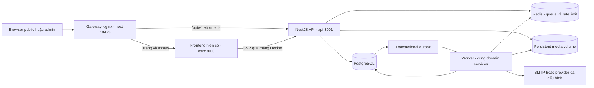
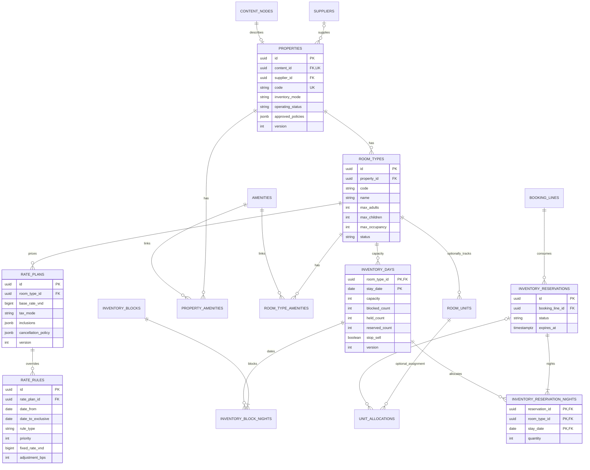
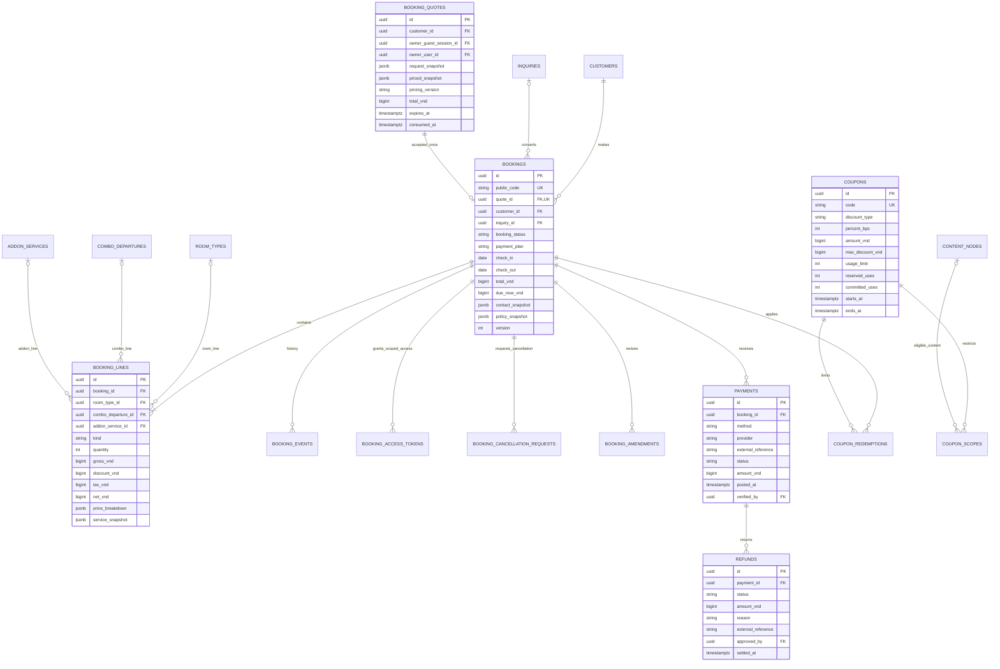
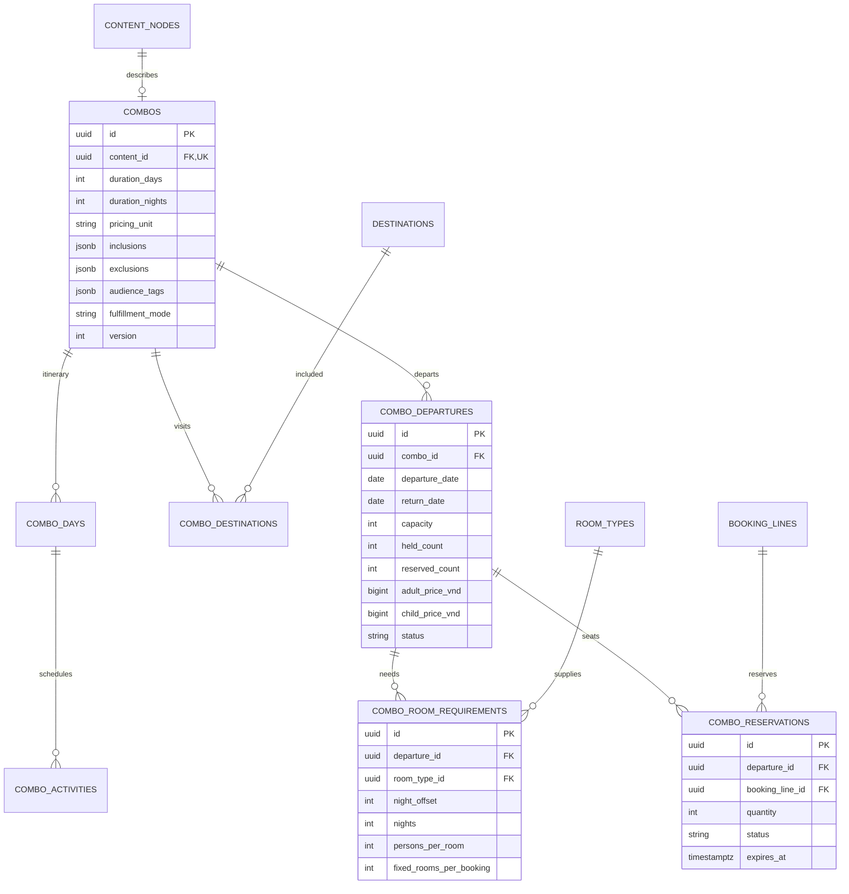
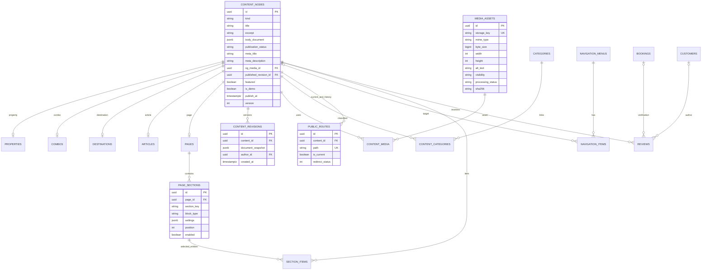
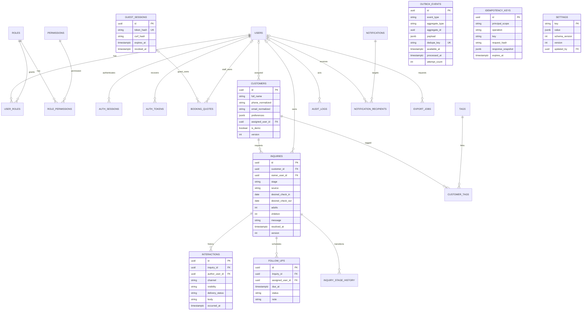
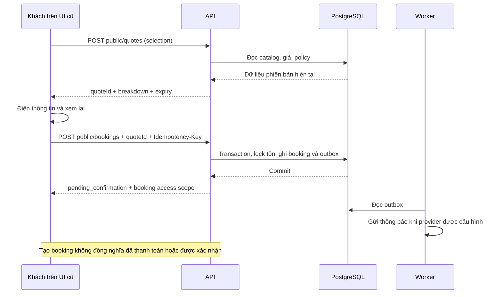

# ĐINH VÂN BOOKING — BACKEND API, POSTGRESQL, NỐI UI VÀ DOCKER

> **Lệnh cho Agent:** tiếp tục ngay trên source giao diện hiện có. Triển khai backend thật, PostgreSQL thật, nối toàn bộ admin và website công khai với API, chạy hệ thống bằng Docker và kiểm thử đến khi luồng nghiệp vụ hoạt động. Không chỉ dựng API mẫu, không chỉ viết kế hoạch, không giữ mock data để làm đẹp giao diện.
>
> **Công nghệ dữ liệu bắt buộc:** PostgreSQL. **Cổng HTTP host đề xuất:** `18473`. Chỉ một cổng host dùng chung cho website và API; phải kiểm tra cổng trên máy đích trước khi chạy. PostgreSQL và Redis không publish ra host mặc định.
>
> **Giữ nguyên:** thương hiệu **Đinh Vân Booking**, giao diện xanh–kem, font, icon SVG, bố cục và các route đang có. Ảnh `references/a…f` là chuẩn thị giác, không phải nguồn số liệu kinh doanh.
>
> **Bản kế hoạch:** 20/09/2026. Tài liệu này chưa xác nhận source đã được audit hoặc Docker đã chạy trên máy chủ. Agent phải kiểm tra repo, phiên bản, cổng và môi trường thực tế, rồi ghi bằng chứng thực thi.

## Mục lục

1. Mục tiêu, phạm vi và nguyên tắc không hardcode.
2. Audit source và kiến trúc lựa chọn.
3. Quy ước dữ liệu, phân quyền và trạng thái nghiệp vụ.
4. Database diagrams và từ điển bảng PostgreSQL.
5. Ràng buộc SQL, tồn phòng và chống đặt trùng.
6. Giá, báo giá, đặt phòng, thanh toán và hoàn tiền.
7. Hợp đồng REST API và mapping từng màn hình.
8. Nối UI thật, nội dung công khai, media và SEO.
9. Worker, thống kê, thông báo và tích hợp ngoài.
10. Docker, kiểm tra cổng, cấu hình và vận hành.
11. Migration, seed, nhập dữ liệu và backup.
12. Lộ trình thực thi, kiểm thử và tiêu chí bàn giao.
13. Nguồn kỹ thuật đối chiếu.

---

## 1. Mục tiêu và phạm vi

### 1.1. Kết quả bắt buộc

Hoàn thiện cùng một hệ thống gồm website công khai, admin, API, database và worker. Dữ liệu đi theo luồng:

```text
Admin tạo/sửa → API validate + kiểm tra quyền → PostgreSQL commit
             → Admin nhận dữ liệu chuẩn từ server
             → Website công khai đọc cùng dữ liệu đã xuất bản

Khách tìm phòng → API kiểm tra nhu cầu và inventory
               → API báo giá → Khách xem lại và gửi yêu cầu
               → PostgreSQL tạo booking → Admin thấy booking thật
               → Admin xác nhận theo tồn phòng/quy định thực tế
```

Mọi nút đã có trong UI phải được lập danh sách: API nào, quyền nào, bảng nào, kết quả nào. Những chức năng chưa có dịch vụ ngoài phải trả về trạng thái chưa cấu hình rõ ràng, không dựng kết quả thành công giả.

### 1.2. Các màn bắt buộc nối API

| Nhóm | Route giao diện đề xuất; giữ route thực tế nếu repo đã khác | Phạm vi |
|---|---|---|
| A — Tổng quan | `/admin` | KPI, chart, công suất, lịch, booking, yêu cầu, quick actions |
| B — Booking | `/admin/dat-phong` | Tạo/sửa, lọc, xác nhận, nhận/trả phòng, hủy, ghi chú, in/xuất |
| C — Phòng nghỉ | `/admin/phong-nghi` | Cơ sở lưu trú, loại phòng, ảnh, giá, tồn theo ngày, bảo trì |
| D — Combo | `/admin/combo-du-lich` | Combo, lịch trình, khởi hành, giá, năng lực phục vụ, lượt đặt |
| E — CMS | `/admin/diem-den`, `/admin/noi-dung` | Điểm đến, bài viết, nội dung website, media, metadata, preview |
| F — CRM | `/admin/khach-hang`, `/admin/yeu-cau-tu-van` | Khách, yêu cầu, pipeline, ghi chú, lịch hẹn, liên kết booking |
| Public | `/`, `/phong-nghi`, `/phong-nghi/[slug]` | Nội dung homepage, tìm/lọc, gallery, giá và khả dụng |
| Public | `/combo-du-lich`, `/diem-den` | Danh sách và chi tiết theo hình thức UI đang có |
| Public | `/lien-he`, `/dat-phong` | Gửi tư vấn, lấy báo giá, review, gửi booking, xem kết quả có quyền |

**Mở rộng cần thiết cho backend:** các menu Khuyến mãi, Thanh toán, Báo cáo, Cài đặt trước đây chưa được tính hoàn tất. Đợt này tạo API và màn quản trị tối thiểu dùng lại shell/table/form hiện có để vận hành coupon, đối soát thủ công, báo cáo và cấu hình website. Đây là phần suy rộng chức năng, không phải bốn thiết kế mới đã có ảnh duyệt. Không bỏ chúng thành `Coming soon` rồi báo toàn hệ thống hoàn thành.

### 1.3. “Không hardcode” được hiểu chính xác

**Phải lấy từ DB/API:** phòng, giá, tồn, combo, lịch trình, tên và ảnh điểm đến, bài viết, FAQ, menu công khai, banner, section homepage, thông tin chủ thương hiệu, điện thoại/Zalo/email, chính sách, ưu đãi, booking, khách, đánh giá, số liệu, badge đếm, lịch và thông báo.

**Được ở code:** design tokens, layout, icon registry, nhãn thao tác hệ thống, enum và invariant nghiệp vụ, validation kỹ thuật, schema của từng block nội dung. Không biến CSS hoặc danh sách quyền chuẩn thành một CMS phức tạp không cần thiết.

**Seed không phải runtime data source:** dữ liệu khởi tạo được import một lần vào PostgreSQL; ứng dụng chỉ đọc DB. Không có `catch(() => demoData)`, `mockApi`, dữ liệu mẫu trả từ controller, `localStorage` làm nơi lưu booking hoặc `Math.random()` tạo KPI. File fixture chỉ được phép ở test/seed không nhập vào runtime bundle.

Thiếu dữ liệu trả `[]`, `0`, `null` hoặc trạng thái chưa cấu hình đúng ngữ nghĩa. API lỗi phải hiện lỗi/retry, không thay bằng dữ liệu giả. `null` ở analytics nghĩa là chưa đo được, khác với `0` là đã đo nhưng không có phát sinh.

### 1.4. Quyền thực thi của Agent

Được viết source, migrations, tests, tạo container/volume/network **riêng dự án trong môi trường dev/staging được giao**, chạy migration/seed an toàn trên database mới của dự án và nối UI. Không tự ghi vào DB production đang có, đổi DNS, chạy giao dịch thật, gửi hàng loạt email, push/merge/deploy công khai hoặc restart dịch vụ của dự án khác.

Nếu máy đích là shared production host, trước tiên read-only kiểm tra repo, Docker, tài nguyên và cổng; tạo stack cô lập chỉ trong phạm vi được phép. Thiếu credential không ngăn việc hoàn thiện phần local, nhưng phải ghi chính xác phần tích hợp còn thiếu. Không hỏi lại bố cục đã có ảnh/tài liệu.

---

## 2. Audit và kiến trúc

### 2.1. Audit bắt buộc trước khi tạo backend

Đọc `AGENTS.md`, README, package/lockfile, tài liệu admin/public đã có và các file ảnh. Kiểm tra git status; giữ thay đổi chưa commit của chủ dự án. Không giả định repo tên nào hoặc production domain nào từ các dự án khác.

Tạo `docs/backend/current-state-audit.md` với:

- Framework/version/package manager; route thực tế và nơi đặt frontend.
- Auth, API, ORM, DB, provider, Docker và data adapter hiện có; phần có thể tái sử dụng.
- Tất cả fixture/store/data array, UI state persist, API giả, tài nguyên ảnh và form chưa gửi thật.
- Danh sách action/field/component và nguồn dữ liệu hiện tại; business rule còn thiếu.
- Cấu hình đang dùng, chỉ ghi tên biến/trạng thái có thiếu; không ghi giá trị secret.
- Cổng host hiện dùng, namespace/volume/network đang có, disk/RAM; không suy ra cổng rảnh từ môi trường khác.

Tạo `docs/backend/ui-api-matrix.md` theo mẫu:

```text
Route | Component | Read endpoint | Write endpoint | DB tables
Permission | Cache policy | Loading/error state | Test ID | Status
```

Nếu repo có backend phù hợp, tiếp tục và bổ sung PostgreSQL theo kế hoạch migration, không xây backend thứ hai chỉ vì tài liệu đề xuất NestJS. Nếu chưa có backend, dùng lựa chọn dưới đây.

### 2.2. Stack mặc định cho source mới

| Lớp | Lựa chọn |
|---|---|
| Frontend | Giữ Next.js/React hiện có, TypeScript, font và component cũ |
| API | NestJS 11 + Fastify adapter; REST JSON + OpenAPI |
| ORM | Prisma 7, PostgreSQL driver adapter tương thích; SQL migration bổ sung cho constraint đặc thù |
| Database | PostgreSQL 18, bản vá ổn định đã kiểm tra ở thời điểm cài |
| Runtime | Node.js 24 LTS cho backend; frontend kiểm tra compatibility trước khi đổi runtime |
| Background | BullMQ + Redis; worker cùng codebase/domain services với API |
| Media | Local persistent Docker volume ở giai đoạn đầu; storage adapter cho S3-compatible về sau |
| Gateway | Nginx riêng trong Docker, cùng origin cho website và `/api/v1` |
| Test | Unit + PostgreSQL integration + browser E2E; không chỉ test bằng SQLite/mock |

Đây là quyết định kiến trúc của dự án, không phải yêu cầu nâng major một repo đang hoạt động. Node 24 đang được trang phát hành chính thức liệt kê là LTS khi đối chiếu tài liệu.[S1] Nest có Fastify adapter; middleware của Express không mặc nhiên tương thích.[S2] Recipe Prisma của Nest hiện có lưu ý về cấu hình module format với Prisma 7.[S3]

Agent phải chốt versions thực sự cài trong `docs/backend/versions.md`, commit lockfile và ghi image digest trước bản triển khai công khai. Không dùng `latest`, dependency không khóa hoặc prerelease. Pin cùng version tương thích cho Prisma CLI/client/adapter; không copy cú pháp Prisma 6 vào Prisma 7 rồi tắt kiểm tra.

Với Nest CommonJS có thể dùng Prisma generator `moduleFormat = "cjs"`; nếu repo dùng ESM, giữ ESM xuyên suốt. `prisma.config.ts`, driver adapter, path generated client và pool đều phải được build/test thật. Migrations giữ trong repo; không dùng ORM `synchronize` hoặc `db push` thay migration production.

### 2.3. Kiến trúc triển khai



Modular monolith, không microservices riêng cho từng menu. Chia module `auth`, `catalog`, `inventory`, `pricing`, `bookings`, `payments`, `combos`, `crm`, `content`, `media`, `reports`, `settings`, `notifications`, `jobs`.

Chỉ backend truy cập PostgreSQL. Frontend không mang Prisma/database URL; browser không gọi host Docker như `http://api:3001`. SSR gọi `INTERNAL_API_BASE_URL`, browser gọi relative `/api/v1`.

---

## 3. Quy ước dữ liệu và bảo mật

### 3.1. Kiểu dữ liệu

- PK `uuid`; mã hiển thị booking riêng, unique, không dùng `MAX(id)+1`.
- DB tên `snake_case`; JSON API `camelCase`; mapper/serializer tập trung.
- `created_at`, `updated_at`, thời điểm gửi/duyệt dùng `timestamptz`. Lưu UTC, hiển thị `Asia/Ho_Chi_Minh`; DB settings chứa business timezone hợp lệ.
- Ngày lưu trú dùng `date`: khoảng **`[check_in, check_out)`**. Checkout không chiếm thêm một đêm.
- Tiền VND dùng `bigint`, không float. JSON xuất **chuỗi số nguyên**, ví dụ `"2520000"`; formatter/UI adapter không dùng `Number()` thiếu kiểm soát.
- Tỷ lệ dùng basis points integer: 10% = 1000, 30% = 3000. Giá/tỷ lệ kinh doanh đọc DB, các ví dụ chỉ phục vụ test.
- Có `version integer` trên record chỉnh sửa; mutations gửi `expectedVersion` để phát hiện lost update.
- JSONB dùng cho rich-text AST, nội dung block, policy snapshot, báo giá và audit diff; không nhét toàn bộ customers/bookings/inventory vào một JSON blob.
- Dữ liệu demo có `is_demo`/dataset metadata rõ ràng. Production release gate chặn public dữ liệu demo, review giả và contact chưa được duyệt.

### 3.2. Các trạng thái tách biệt

| Entity | Trạng thái tối thiểu |
|---|---|
| Booking | `pending_confirmation`, `confirmed`, `checked_in`, `completed`, `cancelled`, `expired`, `no_show` |
| Reservation inventory | `held`, `reserved`, `released`; giữ ledger lịch sử |
| Payment transaction | `pending`, `posted`, `voided`, `reversed`; không đồng nhất với booking |
| Refund | `requested`, `approved`, `processing`, `settled`, `failed`, `rejected` |
| Publication | `draft`, `published`, `hidden`, `archived`; có scheduled publication riêng |
| Inquiry | `new`, `consulting`, `waiting`, `won`, `lost`; xử lý/đã đọc riêng |
| Notification delivery | `queued`, `processing`, `sent`, `failed`, `disabled` |

Payment summary `unpaid/partially_paid/paid/partially_refunded/refunded` được tính từ giao dịch và refunds, không nhận tùy ý từ client. Trạng thái tài chính còn cần các con số `netReceivedVnd`, `collectibleVnd`, `creditVnd`, `refundDueVnd` để không che khoản thu dư hoặc nghĩa vụ hoàn.

Một Customer có nhiều Inquiry; `won` thuộc Inquiry. Publication của nơi lưu trú khác trạng thái mở bán và khả dụng từng ngày. Không cho thao tác “Tạm ẩn” xóa inventory hoặc hủy booking.

### 3.3. Auth và phân quyền

Mặc định dùng **server-side session** cho admin cùng origin, không dựng JWT refresh flow không cần thiết. Token phiên ngẫu nhiên đủ mạnh, DB chỉ lưu hash; cookie `HttpOnly`, `SameSite=Lax`, `Secure` khi HTTPS, scope chính xác. Rotate session sau login/đổi quyền; có idle timeout, absolute expiry, revoke khi khóa tài khoản/đổi mật khẩu. Các nguyên tắc session/cookie đối chiếu OWASP.[S4]

Public checkout dùng guest_sessions riêng, không tạo tài khoản admin giả: CSRF bootstrap thiết lập cookie opaque cho khách, quote FK owner_guest_session_id hoặc owner_user_id theo XOR. Booking lookup/cancellation/evidence chỉ được cấp quyền cho booking cụ thể; biết email/điện thoại/mã đơn không được truy cập lịch sử của Customer. Contact trùng chỉ là gợi ý đối soát nội bộ, không tự xác minh danh tính người gửi.

Có CSRF token gắn session và Origin check cho state-changing requests; login cũng có chống login-CSRF. Không coi SameSite là biện pháp duy nhất. CORS đóng mặc định khi cùng origin; môi trường khác origin dùng allowlist chính xác, không `*` với credential.

| Vai trò | Quyền chính |
|---|---|
| Owner | Tất cả trong ứng dụng; quản trị user/quyền/cấu hình, phê duyệt tài chính |
| Operator | Booking, CRM, tồn phòng theo quyền; không tự nâng quyền/đổi secret |
| Editor | Catalog/nội dung/media/SEO; không đọc PII khách hoặc giao dịch nếu không được cấp |
| Accountant | Xem booking cần thiết, ghi nhận tiền/đối soát/hoàn tiền theo quyền; không sửa nội dung |
| Viewer | Read-only những module đã cấp; PII/export mặc định hạn chế |

Mỗi endpoint/mutation có permission code; kiểm tra object-level permission cả endpoint detail, export, media private và global search. Ẩn nút không thay thế backend guard. Không mở public admin registration hoặc reset password làm lộ user tồn tại. Bootstrap owner bằng CLI một lần, đọc secret từ terminal/file riêng, không hardcode `admin/123456`, không in password vào log.

Bảo vệ PII: không đưa phone/email/note vào URL, analytics, error tracker hoặc log body mặc định. Audit chỉ lưu diff cần thiết có mask; exports/private attachments có quyền, expiry và retention. Không thu thông tin thẻ hoặc giấy tờ định danh vượt nhu cầu triển khai.

---

## 4. Database diagrams PostgreSQL

Các diagram sau là **logical schema đã chọn**, chia nhóm để đọc được. Từ điển bảng ở mục 4.6 bổ sung trường/index mà diagram lược bớt. Agent phải tạo schema ORM + SQL migrations tương ứng và cập nhật diagram theo schema cuối, không bàn giao hình không khớp DB.

### 4.1. Catalog, giá và tồn phòng



`INVENTORY_RESERVATION_NIGHTS(room_type_id, stay_date)` và `INVENTORY_BLOCK_NIGHTS(room_type_id, stay_date)` có **composite FK thật** về `INVENTORY_DAYS`. Property ≠ RoomType ≠ RoomUnit. Ví dụ 4 nơi lưu trú không có nghĩa chỉ 4 phòng.

### 4.2. Booking, tiền và ưu đãi



Với booking có lưu trú, check_in/check_out bắt buộc và checkout sau checkin; combo chỉ trong ngày không chiếm room-night, để cặp trường này null và dùng ngày/giờ dịch vụ từ departure/line. Không đặt checkout bằng checkin để giả một đêm. Combo departure cho phép return_date bằng departure_date khi duration_nights=0; line lưu trú phải có interval riêng đúng yêu cầu.

Một booking có thể có nhiều loại phòng/add-on; không gắn mọi khoản tiền vào một `room_id` duy nhất. `BOOKING_LINES.kind` quyết định FK hợp lệ; SQL CHECK đảm bảo room/combo/add-on không cùng được set cho một dòng. Phí/điều chỉnh có kind riêng, lý do và quyền riêng; không nhận tùy tiện từ public payload.

### 4.3. Combo và năng lực phục vụ



Một booking combo tiêu thụ suất khởi hành và, khi cấu hình yêu cầu phòng, cùng lúc tiêu thụ room inventory. Phòng được lưu thành `INVENTORY_RESERVATIONS` liên kết dòng combo; không tính lại tiền phòng lần hai nếu đã nằm trong giá gói. Combo nhóm và combo theo người có `pricing_unit` khác nhau; capacity unit phải được công bố rõ.

### 4.4. CMS, media, route và homepage



`CONTENT_NODES` là supertype có FK cho các domain public, không phải EAV lưu mọi nghiệp vụ. Mỗi row chỉ thuộc đúng một subtype theo `kind`; kiểm tra bằng constraint trigger/migration hoặc cơ chế tương đương được test. Nội dung draft và bản published phải được phân biệt: sửa nháp không làm public hiển thị nửa bài đang soạn.

Bắt buộc published_revision_id thuộc chính content_id đó: composite FK hoặc deferred constraint tương đương, không chỉ FK tới một revision bất kỳ. Published snapshot của page bao gồm section settings/items, media references và metadata; public không đọc trực tiếp bảng sections đang sửa nháp. Danh mục/ảnh cần publish dùng snapshot hoặc revision-aware joins, không để editor nháp làm rò thay đổi ra public. Giá/tồn vận hành có rule hiệu lực riêng, không nhầm với bản nháp bài viết.

`PUBLIC_ROUTES.path` unique trên cả route hiện tại lẫn lịch sử; chỉ một current route cho mỗi content. Route cũ resolve về content rồi redirect thẳng current route, không nối chuỗi A→B→C.

### 4.5. CRM, người dùng và hạ tầng nghiệp vụ



`aggregate_type/id` trong outbox/audit là tham chiếu sự kiện, không thay FK nghiệp vụ của booking. Không serialize nguyên khách/payment vào event payload; dùng ID và dữ liệu tối thiểu. `AUTH_TOKENS` lưu hash, loại token, expiry, used_at, không lưu token reset password dạng rõ.

### 4.6. Từ điển bảng và constraints phải triển khai

Mọi bảng nghiệp vụ có timestamps; bảng chỉnh sửa có `version`; actor FK phù hợp. Bảng join dùng composite PK/unique. Các trường sau ngoài diagram vẫn là phần bắt buộc khi chức năng tương ứng tồn tại.

| Bảng / nhóm | Trường và ràng buộc quan trọng |
|---|---|
| `users`, `roles`, `permissions`, `user_roles`, `role_permissions` | Email login normalized unique; password_hash; disabled_at; codes unique; FK không mồ côi |
| `auth_sessions`, `auth_tokens` | token_hash unique, user_id, CSRF binding, expires_at, revoked_at/used_at; không đưa vào export |
| `guest_sessions`, `booking_access_tokens` | Guest session token_hash/CSRF/expiry; booking access token có booking_id FK, token_hash unique, expiry/revoked_at và quyền tối thiểu; không quyền xem toàn bộ Customer |
| `suppliers` | Tên đầu mối, contact private, contract/allotment note; không tự tạo tài khoản nhà cung cấp |
| `properties` | content_id unique, supplier_id nullable, code unique, location/address text, tọa độ nullable hợp lệ, inventory_mode, operating_status, check-in/out time, policy snapshot source |
| `room_types` | unique(property_id, code), tên, sức chứa người lớn/trẻ em/tổng, mô tả giường, diện tích nullable, active; capacity người khác capacity số phòng |
| `room_units` | unique(room_type_id, code); chỉ tạo nếu có danh sách unit thật; không sinh room number giả |
| `amenities`, các join | Code unique; label/icon_key được allowlist; scope property/room; custom SVG từ user không render trực tiếp |
| `rate_plans` | room_type_id, currency VND, base_rate, breakfast/include flags, min/max stay, cancellation/deposit/tax policies, active |
| `rate_rules` | Khoảng nửa mở, weekday mask, rule_type, fixed/adjustment mutually exclusive, priority, active; chặn ambiguity cùng priority |
| `inventory_days` | PK(room_type_id, stay_date); capacity/blocked/held/reserved không âm; tổng không vượt capacity; missing row = chưa mở bán |
| `inventory_blocks`, `inventory_block_nights` | Lý do, kind maintenance/internal, status, actor; FK loại phòng/ngày + quantity; sửa/hủy cập nhật counter cùng transaction |
| `inventory_reservations`, `inventory_reservation_nights` | Loại phòng/ngày/quantity, ledger trạng thái và expiry; mỗi version line có reservation set xác định; không xóa lịch sử |
| `unit_allocations` | Optional; unit_id, booking/reservation nullable, kind stay/maintenance/block, date range, active; exclusion constraint chống chồng một unit |
| `addon_services` | code unique, tên, content/media relation optional, unit `person_day/trip/person/vehicle_day`, amount, active, limits và phạm vi property/combo qua bảng join có FK |
| `booking_quotes` | Input normalize, priced snapshot, line detail/night detail, versions catalog/policy, currency, expiry, owner session/admin binding, consumed_at |
| `bookings` | quote_id unique, code unique, customer/inquiry FKs, contact & policy snapshots, sums, source/channel, source_reference optional, guest counts, status, timestamps chuyển trạng thái |
| `booking_lines` | FK đúng kind, quantities, gross/discount/tax/net, scheduled service dates, snapshot tên/giá/đơn vị; không cascade delete từ catalog |
| `booking_events`, `booking_amendments` | Trạng thái cũ/mới, actor, lý do; amendment before/after snapshot, delta và expected_version; append-only |
| `booking_cancellation_requests` | booking_id FK, requested_by_user/guest scope, reason, requested/approved/rejected status, reviewed_by/time, version; yêu cầu hủy chưa làm release/refund |
| `coupons`, `coupon_scopes` | code normalized unique; validity, percent/fixed/max/min, allowed targets, limits global/per-customer, counters; không áp dụng coupon chưa mở bán |
| `coupon_redemptions` | coupon_id + booking_id unique, reserved/committed/released, savings snapshot; aggregate counters trong lock |
| `payments` | booking_id, positive amount, method/provider/reference, status, verified_by, evidence_media_id FK private; unique provider+external_reference khi có |
| `refunds` | payment_id, amount>0, request/approval/settlement actor/time, idempotency, reference; tổng refund có hiệu lực không vượt tiền khả dụng |
| `combos`, `combo_days`, `combo_activities` | content_id unique, days/nights, pricing_unit, fulfillment_mode; unique(combo_id, day_no); vị trí activity ổn định |
| `combo_destinations` | combo_id + destination_id unique, position; không lưu chỉ tên trong array thay FK |
| `combo_departures`, `combo_reservations` | capacity/held/reserved check, giá theo đối tượng, giờ/ngày, booking cutoff, status; booking_line FK và reservation expiry |
| `combo_room_requirements` | departure_id, room_type_id, ngày tương đối, số đêm, công thức rooms/persons rõ; không trừ cả departure allotment và booking allotment hai lần |
| `customers`, `customer_tags`, `tags` | Tên tiếng Việt, normalized contact, tags, owner, consent fields; không auto merge người có cùng số điện thoại |
| `inquiries`, `inquiry_stage_history` | Khách, nhu cầu, lịch/ngân sách nếu khách nhập, owner, stage, source, timestamps; won phải gắn booking hợp lệ hoặc kết quả được duyệt |
| `interactions`, `follow_ups` | Internal note khác tin gửi; follow-up timezone/owner/status/notification dedupe; không tự coi là lịch Google |
| `content_nodes`, `content_revisions` | Source draft, revision published, metadata, noindex, canonical nếu được duyệt; version; không public draft qua API list/detail |
| `destinations`, `articles`, `pages` | content_id unique; destination category/location; article author/read time derive; page key unique (`home`, `contact`, `terms`...) |
| `categories`, `content_categories` | taxonomy/kind, slug unique trong taxonomy, parent_id optional FK; kiểm tra chu trình cây |
| `media_assets`, `content_media` | storage key unique, hash, mime verified, size, dimensions, alt/caption, status, visibility; role cover/gallery/OG, position; cover unique theo scope |
| `public_routes` | normalized path unique, content_id, current flag; partial unique current per content; old path redirect thẳng current |
| `navigation_menus`, `navigation_items` | Menu key unique, cây parent, label/order, content_id hoặc external URL (XOR), enabled; chặn scheme độc hại và cycle |
| `page_sections`, `section_items` | Page FK, section_key unique trong page, block schema/version, order; selected content FK; không nhúng giá/availability vào block JSON |
| `reviews` | content/customer/booking FK nếu xác minh, rating trong thang đã chọn, moderation, source, is_verified, is_demo, consent; không seed review giả lên production |
| `settings` | Typed schema cho brand/contact/business/booking/SEO/site; version; public allowlist; không lưu secret plain text ở đây |
| `notifications`, `notification_recipients` | Event/entity liên quan, payload tối thiểu; mỗi user notification unique; read_at riêng, không global read |
| `audit_logs` | actor/action/entity/before-after diff masked/request_id/time; append-only, không chứa password/token/đầy đủ PII |
| `outbox_events` | Transactional event, dedupe unique, attempts/error/lease; worker retry; không coi queue Redis là nguồn bền duy nhất |
| `idempotency_keys` | unique(principal_scope, operation, key), request_hash, outcome, response tối thiểu, expiry; không leak kết quả sang user khác |
| `webhook_events` | provider/event_id unique, signature_verified, payload hash, status/error; raw payload chỉ lưu khi cần, mã hóa/retention |
| `export_jobs` | user, filter snapshot, permission scope, status, private file id/path, expires_at; tải phải kiểm tra quyền lại |
| `analytics_events` | Event UUID unique, event_type, content_id, anonymous session hash, timestamp, consent; không PII/query raw; retention |
| `job_runs` | job kind, start/end, status, processed/error counts, heartbeat; không ghi secrets |
| `user_pins`, `inquiry_reads` | unique(user_id, content_id) và unique(user_id, inquiry_id); FK thật, ghim nội bộ/đã đọc từng user độc lập dữ liệu public/stage |
| `addon_property_scopes`, `addon_combo_scopes` | Composite PK(addon_service_id, property_id/combo_id), FK thật, điều kiện sử dụng; không IDs trong string list |

Bảng join phụ chưa hiện trong diagram (add-on scope, menu parent, OG media) phải được thêm vào ERD vật lý khi Agent tạo migration. Không được thực thi FK dạng string “sẽ nối sau”. Không làm soft-delete đại trà cho mọi bảng: catalog archive; tài chính/booking giữ lịch sử; purge PII chỉ theo quy trình retention được duyệt.

---
## 5. PostgreSQL constraints và chống đặt trùng

### 5.1. Hai chế độ cung cấp phòng — không giả đồng bộ nhà cung cấp

`allotment`: chủ hệ thống có quỹ phòng được phép bán và đã nhập vào DB. Hệ thống có thể giữ/xác nhận trong giới hạn quỹ đó.

`on_request`: chưa có quỹ phòng được bảo đảm hoặc chưa tích hợp nhà cung cấp. Public hiển thị **“Cần xác nhận tình trạng phòng”**, nhận yêu cầu thật nhưng không hứa còn phòng và không thu tiền trước khi có xác nhận nghiệp vụ. Muốn xác nhận bằng engine inventory, Operator phải ghi nhận quỹ phòng cho đúng khoảng ngày sau khi kiểm tra với nhà cung cấp, sau đó đi qua cùng transaction cấp tồn.

Cơ chế dưới đây chống bán vượt **quỹ phòng của hệ thống**. Nó không tự chống bán trùng trên các kênh ngoài như Booking.com/Agoda khi chưa có tích hợp/đồng bộ nguồn tồn thật. Source/channel chỉ là metadata, không phải chứng cứ đã đồng bộ OTA.

### 5.2. DDL mẫu bắt buộc cho inventory

Đây là SQL bổ sung vào migration sau khi đã tạo bảng liên quan. Tên constraint cần thống nhất với ORM. `available` tính từ counter; không cho client gửi số còn lại tùy ý.

```sql
ALTER TABLE inventory_days
  ADD CONSTRAINT inventory_nonnegative_ck CHECK (
    capacity >= 0 AND blocked_count >= 0
    AND held_count >= 0 AND reserved_count >= 0
  ),
  ADD CONSTRAINT inventory_capacity_ck CHECK (
    blocked_count + held_count + reserved_count <= capacity
  );

ALTER TABLE inventory_reservation_nights
  ADD CONSTRAINT reservation_quantity_ck CHECK (quantity > 0),
  ADD CONSTRAINT reservation_inventory_day_fk
    FOREIGN KEY (room_type_id, stay_date)
    REFERENCES inventory_days (room_type_id, stay_date)
    ON DELETE RESTRICT;

ALTER TABLE bookings
  ADD CONSTRAINT booking_dates_ck CHECK (
    (check_in IS NULL AND check_out IS NULL) OR
    (check_in IS NOT NULL AND check_out IS NOT NULL AND check_out > check_in)
  ),
  ADD CONSTRAINT booking_amounts_ck CHECK (
    total_vnd >= 0 AND due_now_vnd >= 0 AND due_now_vnd <= total_vnd
  );

ALTER TABLE combo_departures
  ADD CONSTRAINT combo_capacity_ck CHECK (
    capacity >= 0 AND held_count >= 0 AND reserved_count >= 0
    AND held_count + reserved_count <= capacity
  );

CREATE UNIQUE INDEX public_routes_one_current_uq
  ON public_routes (content_id) WHERE is_current;

CREATE UNIQUE INDEX payments_provider_reference_uq
  ON payments (provider, external_reference)
  WHERE external_reference IS NOT NULL;

CREATE UNIQUE INDEX idempotency_scope_uq
  ON idempotency_keys (principal_scope, operation, key);
```

Không dùng CHECK để truy vấn SUM từ các hàng/bảng khác. Counter/ledger được cập nhật cùng transaction, có reconciliation test/job phát hiện drift. PostgreSQL mô tả rõ vai trò CHECK, UNIQUE, FK và giới hạn của CHECK với dữ liệu ngoài hàng.[S5]

Nếu bật theo dõi **phòng vật lý**, bổ sung trong migration:

```sql
CREATE EXTENSION IF NOT EXISTS btree_gist;

ALTER TABLE unit_allocations
  ADD CONSTRAINT unit_allocation_dates_ck
    CHECK (date_to_exclusive > date_from),
  ADD CONSTRAINT unit_no_overlap_excl
    EXCLUDE USING gist (
      room_unit_id WITH =,
      daterange(date_from, date_to_exclusive, '[)') WITH &&
    ) WHERE (active);
```

Ở chế độ pooled room type, không hứa tự động cùng một room number mọi đêm. Khi cần bảo đảm cùng phòng vật lý, phải tìm và cấp một unit khả dụng xuyên toàn khoảng; unit allocation và counter room type cập nhật cùng transaction. Block/bảo trì vật lý cũng đi qua `unit_allocations`, không tạo bảng phụ khiến exclusion không nhìn thấy.

### 5.3. Transaction tạo booking có giữ tồn

Không chỉ `SELECT available` rồi `INSERT booking` ngoài transaction. Mọi lối tạo/sửa/xác nhận/hủy/expire/bảo trì đều qua cùng `InventoryService`.

**Trình tự lock chuẩn:** idempotency record → quote nếu có → booking(s) theo ID → inventory_days theo `(room_type_id, stay_date)` → combo_departures theo ID → coupons theo ID → payment/refund rows liên quan. Các operation chỉ cần một tập con vẫn tuân theo thứ tự này. Worker không được dùng thứ tự đảo ngược.

1. Validate DTO, guest counts, date range, permission và ownership quote; reject field ngoài contract.
2. Giới hạn số đêm/số phòng/số dòng từ business settings đã validate, tránh khóa hàng loạt vô hạn.
3. Mở transaction, lock idempotency key. Cùng key + khác payload → `409 IDEMPOTENCY_KEY_REUSED`; cùng payload đã hoàn tất → trả kết quả cũ trong cùng principal scope.
4. Lock quote, kiểm tra expiry/consumed/price version; tạo booking row mới trong transaction. Quote không được dùng tạo hai booking.
5. Xác định đủ các đêm và các room types cần cấp, bao gồm phòng đi kèm combo.
6. Lock **tất cả hàng inventory đã tồn tại** theo thứ tự ổn định. Thiếu một ngày hoặc `stop_sell` → không bán, không tự tạo hàng capacity giả.
7. Kiểm tra mỗi ngày `capacity - blocked - held - reserved >= quantity`.
8. Lock/check suất combo và coupon quota nếu có. Gộp nhu cầu cùng loại/ngày trước khi check, không để hai dòng trong một đơn tự chiếm trùng quỹ.
9. Ghi booking, lines, reservation ledgers, tăng held counters, coupon reservation, contact/policy/price snapshots.
10. Ghi booking event, audit, outbox, kết quả idempotency; commit.
11. Sau commit mới enqueue/notify. Gửi email thất bại không rollback booking đã lưu và không yêu cầu client tạo lại đơn mới.

SQL pattern, các tham số phải bind, không nội suy input:

```sql
BEGIN;

SELECT room_type_id, stay_date, capacity, blocked_count,
       held_count, reserved_count, stop_sell
FROM inventory_days
WHERE room_type_id = $1
  AND stay_date >= $2::date
  AND stay_date < $3::date
ORDER BY room_type_id, stay_date
FOR UPDATE;

-- Application kiểm tra đủ số đêm, stop_sell và capacity của MỌI row.
-- Trong cùng transaction: tạo booking/lines/reservations và update counters.
-- Không gọi HTTP provider hoặc chờ người dùng tại đây.

COMMIT;
```

Với nhiều room type, lock tập hợp trong một thứ tự chung, không lặp theo thứ tự người dùng gửi. `FOR UPDATE` khóa các hàng đã chọn tới cuối transaction; quy tắc lock thống nhất giúp giảm deadlock.[S6] Thiết lập timeout hữu hạn và retry toàn transaction có giới hạn/jitter khi gặp deadlock/serialization failure; không retry `OUT_OF_STOCK` như lỗi mạng.

Mặc định dùng `READ COMMITTED` + explicit row locks + constraints cho capacity đã materialize theo ngày. Các invariant không thể quy về hàng lock phải dùng guard row hoặc Serializable + retry. Không cho rằng đổi isolation level là thay thế cho logic kiểm tra/ledger.

### 5.4. Giữ chỗ, xác nhận, expire và hủy

| Operation | Inventory / booking / payment |
|---|---|
| Tạo pending có allotment | Tăng held; reservation `held`; expiry lấy policy DB; chưa `confirmed/paid` |
| Xác nhận khi hold còn hạn | Giảm held, tăng reserved cùng số lượng; reservation `reserved`; booking confirmed |
| Xác nhận sau hold hết hạn | Không chuyển thẳng; giải phóng hold hết hạn theo service rồi thử cấp tồn lại trong transaction; thiếu tồn → conflict |
| Expire pending | Lock booking + tài nguyên; chỉ release reservation vẫn held và thực sự đến hạn; đánh booking expired; không xóa payment |
| Hủy trước lưu trú | Reason bắt buộc; release phần tồn active theo đúng đêm; giữ ledger/events; đánh cancelled; xử lý nghĩa vụ hoàn riêng |
| Hoàn tất sau checkout | Không release counter lịch sử như thể đêm đó chưa từng bán; giữ reserved historical room-nights để báo cáo |
| Sửa ngày/phòng | Tạo amendment, cấp mới/release cũ atomically trên hợp tất cả ngày/type; thiếu tồn rollback toàn bộ |
| Bảo trì/block | Lock days, check capacity còn lại; không giảm capacity dưới allocations đang có; không tự hủy khách để làm đủ |
| On-request | Lưu booking/yêu cầu pending thực; chưa giữ tồn chưa được bảo đảm; không bật thu tiền tự động |

Hold expiration chạy bằng worker **và** cơ chế phục hồi/reconciliation. Nếu worker chết, hold cũ vẫn chiếm counter cho đến khi được release: có thể bán ít hơn tạm thời, nhưng không được coi counter đó là trống rồi bán vượt. Path phục hồi phải lấy booking lock trước inventory lock; không đảo thứ tự để “dọn nhanh”.

Thay đổi `held → reserved → released` phải idempotent. Confirm/cancel/expire trùng lần không cộng/trừ lại. Khách no-show, trả phòng sớm và sửa đơn đang lưu trú có action/policy riêng, ghi rõ đêm nào còn giữ; không dùng endpoint hủy đơn tương lai để xử lý tất cả.

### 5.5. Kế hoạch mở bán inventory

Admin có màn chỉnh quỹ phòng theo khoảng ngày và room type, cùng preview thay đổi trước khi lưu. Có template mở bán theo ngày chỉ khi chủ hệ thống đã cấu hình quỹ phòng hợp lệ; worker mở rộng horizon từ template được duyệt, không mặc định “100 phòng” để search có kết quả.

Khoảng tìm kiếm vượt horizon hoặc chưa có giá một đêm → trả `availability=unknown/not_open`, không giá 0. Với nhiều đêm, `availableRooms` là số nhỏ nhất còn bán trên từng đêm, không SUM tồn các đêm.

---

## 6. Pricing, booking và tài chính

### 6.1. Pricing service là nguồn tính tiền duy nhất

`PricingService.createQuote()` nhận selection IDs/ngày/khách/add-on/coupon/paymentPlan; tự đọc giá, policy và điều kiện DB. Không nhận tổng tiền, đơn giá, discount percentage hoặc `paid=true` từ browser.

Quy tắc giá theo từng đêm được cấu hình và version hóa:

```text
Override chính xác theo ngày
    > Mùa có priority cao nhất và phù hợp ngày/thứ
    > Giá cuối tuần theo weekday set được cấu hình
    > Giá cơ bản của rate plan đang hoạt động
```

Không cộng dồn nhiều phần trăm chưa có policy. Nếu nhiều rule cùng priority cùng scope áp dụng cho một đêm, chặn lưu rule hoặc trả conflict; không chọn tùy tiện theo thứ tự array. Min/max stay, occupancy, included breakfast và child pricing phải được kiểm tra.

Add-on theo đơn vị rõ ràng: người×ngày, lượt xe, người tham gia một lần, xe×ngày. Bữa sáng đã nằm trong rate plan không thu thêm cùng loại. Combo đã bao gồm lưu trú không cộng thêm phòng lần nữa. Các service dates nằm trong điều kiện của đơn.

### 6.2. Công thức và rounding

```text
roomGross        = sum(nightlyRate × roomCount theo từng đêm)
addonGross       = sum(đơn giá × số lượng theo unit được định nghĩa)
comboGross       = sum(giá theo người/nhóm × quantity hợp lệ)
gross            = roomGross + addonGross + comboGross + phí được cấu hình
discount         = ưu đãi hợp lệ trên eligible lines, có trần
netBeforeTax     = gross - discount
tax              = tính theo tax_mode/policy đã được cấu hình
total            = netBeforeTax + phần thuế chưa nằm trong giá
dueNow           = áp dụng deposit policy lên total hoặc toàn bộ total
remainingToPlan  = total - dueNow
```

Dùng BigInt/Decimal chính xác. Với số tiền và basis points không âm, half-up có thể triển khai `(amount * bps + 5000n) / 10000n`. Phân bổ discount/thuế làm tròn theo phương pháp xác định (ví dụ largest remainder), bảo đảm tổng line `net_vnd` đúng `booking.total_vnd`. Không dùng `Math.round(float)` trên dữ liệu đã vượt miền an toàn.

Thuế/phí là policy do chủ hệ thống xác nhận, không mặc định “VAT theo yêu cầu hóa đơn”. Nếu chưa đủ policy công khai, chặn bật checkout thanh toán tự động; vẫn có thể nhận tư vấn. Không tuyên bố “đã gồm toàn bộ thuế phí” khi DB chỉ chưa có trường thuế.

### 6.3. Quote contract và chống stale giá

Quote lưu DB, có TTL từ settings, owner binding, phiên bản giá/policy, line/night breakdown và currency. Lấy quote **không giữ phòng**; UI ghi đúng điều đó. Khi submit, kiểm tra lại khả dụng trong transaction.

Nếu selection hoặc phiên bản giá/policy thay đổi, trả `409 QUOTE_STALE` với báo giá mới và phần thay đổi; UI yêu cầu khách xem lại/chấp nhận, không tự tăng tiền rồi tạo đơn. Một quote chỉ được consume một lần; cùng idempotency key trả booking đã tạo trước đó.

### 6.4. Luồng public đặt phòng



Public booking response cấp quyền đọc giới hạn bằng cookie guest session hoặc capability ngẫu nhiên chỉ lưu hash server, có expiry. `public_code`/UUID **không phải mật khẩu**. Không cho tra cứu PII chỉ bằng mã đơn hoặc số điện thoại. Token không ở URL query/log; hỗ trợ verification qua email chỉ khi đã tích hợp và chống enumeration.

Tại bước kết thúc, UI ghi **“Đã nhận yêu cầu đặt phòng — đang chờ xác nhận”** khi trạng thái thật là pending. Chỉ hiển thị confirmed/paid từ response DB. Callback URL hoặc query `success=true` không phải bằng chứng thanh toán.

### 6.5. Payment plan khác payment method

`paymentPlan = deposit | full`; `paymentMethod = bank_transfer | cash | configured_provider`. Tỷ lệ cọc, hạn thanh toán và phương thức được bật lấy từ DB settings/policy, không giữ cố định 30% từ mockup.

Phạm vi khả dụng ngay khi chưa chọn cổng: **ghi nhận và đối soát chuyển khoản/tiền mặt thủ công có kiểm soát**, sau khi thông tin người nhận thực đã được chủ hệ thống cấu hình. Không tự thêm Square/Stripe/PayPal/VNPAY từ dự án khác. Provider online mặc định disabled; có interface nhưng không giả endpoint trả thành công.

- Public chỉ xem hướng dẫn đã duyệt, gửi bằng chứng thanh toán private nếu bật; không có API public “đánh dấu đã thanh toán”.
- Staff có quyền tạo payment pending; Accountant/Owner kiểm tra và post receipt với amount, reference, ngày thực nhận, reason/evidence và audit.
- Bằng chứng ảnh/QR không tự xác minh ngân hàng. QR chỉ tạo khi có người nhận/tài khoản thực đã được xác nhận; không dùng số trong ảnh thiết kế.
- Posted payment không sửa amount trực tiếp. Sửa sai bằng reversal có quyền/lý do/log và reversed_at rồi ghi giao dịch đúng; không xóa lịch sử. Không reverse receipt đã có refund pending/settled mà chưa xử lý phụ thuộc theo quy trình đối soát: tránh trừ tiền hai lần. Báo cáo cashflow lịch sử ghi khoản thu tại posted_at và điều chỉnh âm tại reversed_at, không xóa ngược khoản thu khỏi mọi kỳ cũ.
- Refund có đề nghị, phê duyệt, thực hiện và settlement; nút “Hủy đơn” không đồng nghĩa “Đã hoàn tiền”.

**Công thức hiển thị:**

```text
postedReceipts = SUM(payments.amount_vnd với status posted)
settledRefunds = SUM(refunds.amount_vnd với status settled)
netReceived    = postedReceipts - settledRefunds
collectible    = MAX(0, currentBookingTotal - netReceived)
credit         = MAX(0, netReceived - currentBookingTotal)
refundDue      = nghĩa vụ hoàn đã duyệt nhưng chưa settled theo policy
```

Không dùng `collectible=0` để che credit/refundDue. Khi refund do hủy đơn, số phải thu cuối cùng cần amendment/cancellation settlement, không mặc định vẫn bằng giá gốc.

### 6.6. Provider/webhook khi có cấu hình thực

Adapter phải verify signature trên **raw body**, kiểm tra timestamp/replay, amount/currency/booking mapping; lưu event unique, xử lý idempotent và chống out-of-order. Chỉ trả 2xx sau khi event đã được ghi nhận bền vững; tác vụ nặng xử lý qua outbox/worker. Không tin redirect của browser.

Payment đến sau khi hold hết hạn: ghi nhận tiền thật, đánh exception cần xử lý, thử cấp tồn theo transaction nếu policy cho phép. Không ép booking confirmed khi đã hết phòng. Refund/reallocation phải có kết quả thật và được audit. Lặp webhook không tạo receipt/refund hoặc gửi mail lần hai.

### 6.7. Coupon và giới hạn sử dụng

Coupon có scope, min spend, hiệu lực, max discount, global/per-customer quota. Lock coupon row và principal quota trong cùng transaction booking. Trong pending hold dùng reservation quota có expiry; confirm commit quota, expire/cancel release theo policy. Không increment usage khi chỉ thử mã ở trang checkout. Rule release sau cancel của booking đã dùng phải rõ ràng, không cho lạm dụng mã vô hạn.

---

## 7. Hợp đồng REST API

### 7.1. Quy ước chung

Prefix: `/api/v1`. Các bảng endpoint bên dưới ghi đường dẫn sau prefix.

- Phân vùng `public`, `admin`, `auth`, `webhooks`, `health`.
- JSON success `{ data, meta? }`; list `{ data: [], meta: { page, pageSize, total, totalPages, appliedFilters, asOf } }`.
- Query page bắt đầu 1, pageSize mặc định 15/20 theo màn, trần cấu hình kỹ thuật hữu hạn; sort/filter allowlist.
- Một field status luôn đúng domain; không dùng string tiếng Việt tùy ý làm enum lưu DB.
- Money string + `currency: "VND"`; date-only ISO `YYYY-MM-DD`; timestamps ISO UTC.
- Mutation chỉnh record gửi `expectedVersion`; version mismatch → 409, không overwrite mất thay đổi người khác.
- POST tạo booking/receipt/refund/conversion có `Idempotency-Key`; phía server enforce, không chỉ disable button.
- Error thống nhất, requestId truyền xuyên API/worker/log; lỗi người dùng có message tiếng Việt, không lộ SQL/stack.

```json
{
  "error": {
    "code": "OUT_OF_STOCK",
    "message": "Số phòng còn lại không đủ cho khoảng ngày đã chọn.",
    "fieldErrors": [],
    "details": {"unavailableDates": ["2026-10-03"]},
    "requestId": "uuid"
  }
}
```

HTTP: 400 validation, 401 chưa đăng nhập, 403 không đủ quyền, 404 không tồn tại/không công khai, 409 conflict, 413 quá lớn, 422 điều kiện nghiệp vụ không đạt, 429 rate limit, 503 phụ thuộc chưa sẵn sàng. Không mọi lỗi trả HTTP 200.

OpenAPI là contract có schema request/response/enum/example/error/security, tạo TypeScript API types từ nó. Không export Prisma models thẳng ra client. Docs admin chỉ ở dev hoặc sau auth; health public không lộ version/secret chi tiết.

### 7.2. Auth và dữ liệu dùng chung admin

| Method | Endpoint | Chức năng / quyền |
|---|---|---|
| GET | `/auth/csrf` | Bootstrap CSRF/login session hoặc guest session cho public checkout, no-store; không cấp quyền admin |
| POST | `/auth/login` | Rate limit, authenticate, rotate cookie |
| POST | `/auth/logout` | Revoke session thật |
| GET | `/auth/me` | User, permissions, session expiry; không password hash |
| POST | `/auth/change-password` | Mật khẩu hiện tại + mới, revoke phiên khác |
| POST | `/auth/password-reset/request` | Response đồng nhất; chỉ gửi khi mail cấu hình |
| POST | `/auth/password-reset/complete` | One-use token + expiry |
| GET | `/admin/bootstrap` | Config admin allowlist, enums/lookups, quyền, unread counts |
| POST | `/admin/search` | Tìm toàn hệ thống có body query, permission filter; không PII trên URL |
| GET | `/admin/notifications` | Danh sách theo user |
| POST | `/admin/notifications/:id/read` | Chỉ đánh đã đọc cho user hiện tại |
| GET/POST/PATCH | `/admin/users`, `/admin/users/:id` | Owner; role grants có kiểm tra quyền |
| POST | `/admin/users/:id/disable` | Revoke sessions, audit; bảo vệ owner cuối cùng |

### 7.3. Public API — nối homepage và 6 màn

| Method | Endpoint | Dữ liệu / tác vụ |
|---|---|---|
| GET | `/public/site` | Brand/contact/social/menu/settings public; không secret |
| GET | `/public/pages/:pageKey` | Bản published của home/contact/policy, section/block đã validate |
| GET | `/public/properties` | Keyword, area, type, amenities, dates, guests, price, sort, pagination |
| GET | `/public/properties/:slug` | Catalog, gallery, policies approved, room types, review summary đã duyệt |
| GET | `/public/properties/:id/availability` | from/to, rooms, guests; tồn thật hoặc unknown/on-request |
| GET | `/public/properties/:id/rate-plans` | Rate plans đang mở, không trả giá nội bộ/giá vốn |
| GET | `/public/combos` | Lọc ngày/thời lượng/đối tượng/giá, pagination |
| GET | `/public/combos/:slug` | Nội dung, itinerary, inclusion/exclusion, ảnh, giá khởi điểm có nguồn |
| GET | `/public/combos/:id/departures` | Suất khả dụng, unit, ngày, trạng thái; chỉ các departure công khai |
| GET | `/public/destinations` | Danh mục, q, pagination; published only |
| GET | `/public/destinations/:slug` | Bản published, media, nội dung và gợi ý liên quan |
| GET | `/public/articles`, `/public/articles/:slug` | Listing/detail published; route theo frontend đã có |
| GET | `/public/reviews` | target contentId, published approved verified flags; không review demo production |
| GET | `/public/addons` | Theo selection/target; đơn vị, khả dụng, included flags |
| POST | `/public/quotes` | Tính giá server, TTL, validation đầy đủ |
| POST | `/public/bookings` | Consume quote, lưu guest/contact, giữ tồn khi hợp lệ, idempotency |
| GET | `/public/bookings/:publicCode` | Capability/session-scoped, field allowlist, no-store |
| POST | `/public/bookings/:id/cancellation-requests` | Khách yêu cầu hủy, không tự refund; ownership + policy |
| POST | `/public/bookings/:id/payment-evidence` | Multipart private, giới hạn, ownership; không xác nhận đã nhận tiền |
| POST | `/public/inquiries` | Gửi tư vấn thật → CRM; chống spam/duplicate submit |
| POST | `/public/analytics/events` | Optional đo lường first-party, allowlist và consent; rate limit |
| POST | `/public/favorites/resolve` | Optional lấy cards theo IDs; favorites IDs có thể ở máy khách không chứa PII |
| GET | `/public/route-resolution` | path normalized → current/not-found/redirect; không trả draft |
| GET | `/public/sitemap-entries` | Current published canonical URLs; frontend tạo sitemap/robots đúng domain |

GET availability và quote trả `Cache-Control: no-store`. Public facet count tính cùng tập lọc, không lấy số cũ từ fixtures. Giá `from` cần nêu nguồn/min date basis; chưa chọn ngày không giả giá chính xác cho cả kỳ nghỉ.

### 7.4. API admin A — Tổng quan và báo cáo

| Method | Endpoint | Gắn vào |
|---|---|---|
| GET | `/admin/dashboard?from=&to=&timezone=` | 6 KPI + definition + comparison + asOf; scope quyền |
| GET | `/admin/reports/revenue-series` | Chart doanh thu/value/receipts có metric rõ, không trộn trục |
| GET | `/admin/reports/occupancy` | Donut và room-night occupancy theo kỳ |
| GET | `/admin/calendar` | Ngày/tháng, check-in/check-out/follow-up/inventory events theo loại |
| GET | `/admin/bookings?upcoming=true` | Booking sắp tới |
| GET | `/admin/bookings?status=pending_confirmation` | Danh sách cần xác nhận |
| GET | `/admin/inquiries?sort=-createdAt` | Tư vấn gần đây |
| GET | `/admin/reports/top-products` | Top nơi lưu trú/combo, phạm vi và cách đếm rõ |
| GET | `/admin/reports/revenue-breakdown` | Phòng/combo/add-on/tổng, cùng metric với KPI |
| POST | `/admin/report-exports` | Xuất có filter snapshot và quyền |

Nếu frontend đang cần response aggregate, `/admin/dashboard` có thể chứa các widget summary. Không để một trang bắn hàng trăm request cho từng KPI hoặc N+1 cho mỗi row.

### 7.5. API admin B — Booking

| Method | Endpoint | Yêu cầu |
|---|---|---|
| GET | `/admin/bookings` | Filter status/payment/source/dates/dateField/property/combo; count, sort, paginate server |
| GET | `/admin/bookings/:id` | Detail đầy đủ theo quyền, totals, allocations, allowedActions, version |
| POST | `/admin/quotes` | Staff tạo quote dùng cùng pricing engine; override cần quyền/reason riêng |
| POST | `/admin/bookings` | Tạo từ quote và customer; idempotency, nguồn nội bộ được kiểm soát |
| PATCH | `/admin/bookings/:id/contact` | Sửa contact/special requests với expectedVersion; audit |
| POST | `/admin/bookings/:id/amendment-quotes` | Preview thay đổi ngày/phòng/guest/add-on và chênh lệch |
| POST | `/admin/bookings/:id/amendments` | Commit thay đổi nguyên tử; không sửa giá lịch sử không log |
| POST | `/admin/bookings/:id/confirm` | Inventory + policy + version checks |
| POST | `/admin/bookings/:id/check-in` | Booking hợp lệ, ngày hợp lệ, exception cần quyền/reason |
| POST | `/admin/bookings/:id/check-out` | Hoàn tất lưu trú, đối chiếu tiền còn thu; policy rõ |
| POST | `/admin/bookings/:id/cancel` | Reason, cancellation settlement preview/acceptance; không auto refund |
| POST | `/admin/bookings/:id/no-show` | Sau thời điểm cho phép, reason, xử lý tồn/policy |
| GET/POST | `/admin/bookings/:id/notes` | Notes nội bộ, author/time; không gửi khách |
| GET | `/admin/bookings/:id/timeline` | Events/amendments/payment/notifications đã sanitize |
| GET | `/admin/bookings/:id/print-data` | Data cho bản in DOM hiện có, không bắt buộc sinh PDF |
| POST | `/admin/booking-exports` | Chọn IDs/trang/tập lọc có scope rõ; XLSX thật |
| POST | `/admin/bookings/bulk-actions` | Allowed actions only; trả kết quả từng ID, không generic mass delete |

Các action quan trọng không gom thành PATCH nhận bất kỳ `status` từ client. `allowedActions` giúp UI, nhưng server vẫn kiểm tra điều kiện tại thời điểm mutation.

### 7.6. API admin C — Catalog, giá, inventory

| Method | Endpoint | Chức năng |
|---|---|---|
| GET/POST | `/admin/properties` | List/create property + content record trong transaction |
| GET/PATCH | `/admin/properties/:id` | Editor, expectedVersion, private supplier/contact theo quyền |
| POST | `/admin/properties/:id/publication` | Publish/hide/archive; validate readiness; không hủy booking |
| POST | `/admin/properties/:id/pin` | Ghim nội bộ theo user, khác cờ public featured |
| GET/POST | `/admin/properties/:id/room-types` | Loại phòng trong đúng property |
| GET/PATCH | `/admin/room-types/:id` | Sức chứa/giường/tiện ích/status; chặn thay đổi phá allocations |
| GET/POST | `/admin/room-types/:id/units` | Optional room units thật |
| GET/POST | `/admin/room-types/:id/rate-plans` | Giá gốc/policy/inclusions |
| PATCH | `/admin/rate-plans/:id` | Version giá, audit, không sửa snapshot booking |
| GET/POST/PATCH | `/admin/rate-rules`, `/admin/rate-rules/:id` | Rule giá, khoảng, weekdays, priority, conflict |
| POST | `/admin/pricing/preview` | Giá từng đêm trước/sau khi chỉnh rule |
| GET | `/admin/inventory?roomTypeId=&from=&to=` | 7 ngày/tháng, counter và ledger liên quan |
| POST | `/admin/inventory/changes/preview` | Preview capacity/stop-sell theo khoảng; conflict bookings |
| POST | `/admin/inventory/changes` | Apply đã duyệt với expected versions; transaction |
| POST | `/admin/inventory/blocks` | Block/bảo trì range/quantity/reason |
| POST | `/admin/inventory/blocks/:id/release` | Release một lần, audit; không xóa log |
| GET | `/admin/lookups` | Amenities, accommodation types, areas, tags; DB-driven |

Range update lớn chia batch có báo phần nào thành công; mặc định cả một thao tác nhỏ là all-or-nothing. Không dùng optimistic success cho inventory/tiền; giữ form và hiển thị server result.

### 7.7. API admin D — Combo

| Method | Endpoint | Chức năng |
|---|---|---|
| GET/POST | `/admin/combos` | Filter, create |
| GET/PATCH | `/admin/combos/:id` | Editor/detail/version |
| PUT | `/admin/combos/:id/itinerary` | Days/activities reorder trong transaction |
| POST | `/admin/combos/:id/duplicate` | Draft mới, slug mới; không copy booking/analytics/review |
| POST | `/admin/combos/:id/publication` | Publish/pause/archive có checks |
| GET/POST | `/admin/combos/:id/departures` | Lịch khởi hành, capacity và giá |
| PATCH | `/admin/combo-departures/:id` | Không giảm capacity dưới held+reserved |
| PUT | `/admin/combo-departures/:id/room-requirements` | Room types/day offsets/quantities; preview ảnh hưởng |
| GET | `/admin/combos/:id/performance` | Số lượt/giá trị theo kỳ; conversion chỉ khi có measured denominator |

Cả 5 tab hiện có phải dùng data thật. Tên giống property không làm combo dùng chung ID với property.

### 7.8. API admin E — CMS và media

| Method | Endpoint | Chức năng |
|---|---|---|
| GET/POST | `/admin/content` | kind=destination/article/page/property/combo, filters; có field allowlist |
| GET/PATCH | `/admin/content/:id` | Draft/editor/meta/version |
| POST | `/admin/content/:id/duplicate` | Draft mới, route mới |
| GET | `/admin/content/:id/revisions` | Lịch sử bản nháp và published revision |
| POST | `/admin/content/:id/restore-draft` | Khôi phục thành draft mới, không ghi đè public trực tiếp |
| POST | `/admin/content/:id/publish` | Snapshot published revision, validate media/slug/metadata, outbox |
| POST | `/admin/content/:id/hide` | Ẩn public, invalidate ngay; lịch sử giữ |
| POST | `/admin/content/:id/schedule` | Schedule có timezone và version; worker thực thi thực |
| POST | `/admin/content/:id/preview-session` | Preview có quyền, noindex/no-store, token một scope |
| POST | `/admin/content/:id/change-route` | Unique slug/path + route history redirect thẳng current |
| GET | `/admin/content-readiness` | Checklist thiếu trường; không “điểm xếp hạng Google” giả |
| GET/POST/PATCH | `/admin/categories`, `/admin/categories/:id` | Taxonomy/cây không cycle |
| GET/POST | `/admin/media` | Search/filter và upload multipart có thật |
| GET/PATCH | `/admin/media/:id` | Metadata/alt/caption, size/dimensions read-only computed |
| GET | `/admin/media/:id/usage` | Nội dung, cover, OG và chứng từ đang dùng |
| GET | `/admin/media/:id/stream` | Private preview có auth; không qua public Image optimizer thiếu cookie |
| DELETE | `/admin/media/:id` | Chặn asset đang dùng, hoặc quy trình thay thế có preview |
| PUT | `/admin/content/:id/media` | Cover/gallery/order/alt override, FK toàn bộ |
| GET/PUT | `/admin/pages/:key/sections` | Page blocks giữ layout frontend cũ, không arbitrary code |
| GET/PUT | `/admin/navigation/:menuKey` | Menu cây + internal/external targets |

Subtype destination/article fields đi qua DTO chuyên biệt; không cho generic CMS PATCH sửa `bookings`, payment hoặc các bảng tùy tên.

### 7.9. API admin F — CRM

| Method | Endpoint | Chức năng |
|---|---|---|
| POST | `/admin/customers/search` | Search contact/nhu cầu trong body, filter/pagination/sort |
| GET/POST | `/admin/customers` | List không chứa query PII trong URL; tạo có duplicate warning |
| GET/PATCH | `/admin/customers/:id` | Profile, preferences, tags, owner, version |
| GET | `/admin/customers/:id/bookings` | Lịch sử và aggregates từ DB |
| GET | `/admin/customers/:id/inquiries` | Chọn inquiry đang chăm sóc |
| GET/POST | `/admin/inquiries` | List/kanban/stage/owner/due filters; create |
| GET/PATCH | `/admin/inquiries/:id` | Needs, owner, budget/date optional, version |
| POST | `/admin/inquiries/:id/stage` | Transition/log; won có điều kiện; drag/drop gọi endpoint này |
| POST | `/admin/inquiries/:id/read` | Per-user read state |
| POST | `/admin/inquiries/:id/resolve` | Resolved không đồng nghĩa won |
| GET/POST | `/admin/inquiries/:id/interactions` | Internal note/log cuộc gọi/message status thật |
| POST | `/admin/inquiries/:id/booking-draft` | Prefill quote selection; không tự confirm/paid |
| GET/POST | `/admin/follow-ups` | Lịch chăm sóc thực lưu DB |
| PATCH | `/admin/follow-ups/:id` | Sửa hạn/owner/note/version |
| POST | `/admin/follow-ups/:id/complete` | Hoàn tất, audit |
| GET/POST/PUT | `/admin/tags`, `/admin/customers/:id/tags` | Tags DB và join relations |

Thêm bảng per-user inquiry read state hoặc dùng notification receipt có mapping rõ; không một `read_at` toàn cục cho mọi nhân viên. Customer phone/email index hỗ trợ tìm trùng, nhưng không unique bắt buộc nếu mô hình cho gia đình dùng chung liên hệ. Không auto merge data khi public gửi trùng số.

### 7.10. Vận hành tối thiểu của các menu còn lại

| Menu | API / chức năng phải có |
|---|---|
| Khuyến mãi | CRUD `/admin/coupons`, preview conditions, usage history, active/disabled; không xóa coupon đã dùng |
| Thanh toán | `/admin/payments`, `/admin/payments/:id/post`, `/reverse`, `/admin/refunds`, `/approve`, `/settle`; role + idempotency + audit |
| Báo cáo | Cùng reporting service với dashboard, filter/day/period, export jobs, metric definitions |
| Cài đặt | `/admin/settings/:group`, brand/contact/booking/SEO/menu/homepage; version, validation, secret write-only ngoài public settings |
| Export | `/admin/exports/:id`, `/download`; ownership, permission recheck, expiry, không URL public vĩnh viễn |
| Audit | `/admin/audit-logs`; Owner hoặc quyền audit riêng, filter và mask PII |
| Health | `/health/live`, `/health/ready`; ready check DB/migrations/các phụ thuộc bắt buộc |

### 7.11. Ví dụ tạo quote và booking

```json
{
  "roomSelections": [
    {
      "roomTypeId": "<uuid-from-api>",
      "ratePlanId": "<uuid-from-api>",
      "rooms": 1,
      "checkIn": "2026-10-02",
      "checkOut": "2026-10-04",
      "adults": 2,
      "children": 0
    }
  ],
  "addons": [
    {"serviceId": "<breakfast-uuid>", "persons": 2, "days": 2},
    {"serviceId": "<tour-uuid>", "persons": 2}
  ],
  "couponCode": "DVAN10",
  "paymentPlan": "deposit"
}
```

ID/ngày/mã trong ví dụ là fixture test, không default production. Giá trị trả về có dạng:

```json
{
  "data": {
    "quoteId": "<uuid>",
    "currency": "VND",
    "subtotalVnd": "2800000",
    "discountVnd": "280000",
    "totalVnd": "2520000",
    "dueNowVnd": "756000",
    "remainingToPlanVnd": "1764000",
    "expiresAt": "<ISO timestamp>",
    "inventoryHeld": false,
    "lines": [],
    "warnings": []
  }
}
```

Trong response thật, `lines` chứa đủ breakdown; array rỗng ở ví dụ chỉ lược bớt, **không phải acceptance output**. Submit booking chỉ gửi quote và contact đã validate:

```json
{
  "quoteId": "<uuid>",
  "customer": {
    "fullName": "Khách thử nghiệm",
    "phone": "<valid-test-contact>",
    "email": "guest@example.test"
  },
  "specialRequest": "",
  "bookingNote": "",
  "acceptedPolicyVersion": "<version-from-quote>",
  "paymentMethod": "bank_transfer"
}
```

Kèm CSRF/session phù hợp và `Idempotency-Key`. Policy acceptance thực phải ghi version/timestamp, không chỉ boolean. `paymentMethod` chỉ hợp lệ khi method đã enabled cho quote; chưa cấu hình thì UI nhận request không yêu cầu method chưa có.

---
## 8. Nối API vào giao diện đang có

### 8.1. Không viết lại giao diện để né integration

Giữ routes/components/layout/CSS/font/icon đã duyệt. Thay các data repositories và handlers ở đúng ranh giới; chỉ bổ sung field/state cần thiết cho nghiệp vụ thật. Trước và sau integration chụp cùng viewport để phát hiện regression.

Repository API thay demo adapter; UI không tự mở kết nối DB. Tách server-only và browser client:

```text
Browser:
  /api/v1/...                 # cùng origin, credential cookie
Server rendering:
  INTERNAL_API_BASE_URL       # http://api:3001/api/v1 trong Docker
Database:
  chỉ API/worker/migrator có credential; frontend tuyệt đối không có
```

Tạo `lib/api/client`, `lib/api/generated`, `lib/api/errors`, `lib/api/mappers` theo cấu trúc repo thực. Dùng OpenAPI-generated types; API handler không trả internal model tùy tiện. Mỗi mapper có test cho null, money string, timestamp và enum mới.

### 8.2. Những chỗ phải tháo mock

| Hiện tại có thể đang dùng | Sau integration |
|---|---|
| Mảng phòng/combo/destination trong JSX | API list/detail có pagination/filters |
| Chart series, badge 3, KPI 78% cố định | Reports service và counts từ DB |
| Demo clock tháng 11/2024 | Server time + selected report range; test mới dùng clock cố định |
| Store persist booking/customer trong localStorage | Query cache trong memory; source of truth PostgreSQL |
| `setTimeout` rồi toast thành công | Await mutation → lấy canonical response → invalidate đúng cache |
| Browser tính giá quyết định số phải trả | Quote API tính; UI chỉ render breakdown |
| Image array với URL placeholder | MediaAsset records + public/private URL hợp lệ |
| CTA Zalo/phone là số mẫu | Site config đã duyệt hoặc trạng thái chưa cấu hình |
| Published flag đổi chỉ ở frontend | Transition API tạo published revision và cập nhật public |
| Lịch/kanban kéo đổi vị trí local | Mutation có expectedVersion, rollback UI khi conflict |
| Export CSV giả đổi đuôi XLSX | Export job tạo file XLSX đúng định dạng và có quyền tải |

Khi chuyển sang API, xóa chế độ auto fallback demo. Có thể giữ Storybook/test fixture ở môi trường test, không đưa vào build production. Dữ liệu API rỗng không được render lại card mẫu.

### 8.3. Hành vi query/mutation

- Query key chứa entity + filters + permission scope phù hợp; date range rõ nguồn ngày.
- Search debounce, abort request cũ; không để response chậm ghi đè filter mới.
- Filters/sort/pagination do server thực thi; UI có thể xử lý presentation, không tự filter 15 dòng rồi coi là toàn bộ DB.
- PII search nằm trong body hoặc state cục bộ, không URL. Các filter không nhạy cảm và selected UUID có thể trong URL.
- Booking/giá/inventory/payment không optimistic success. Thao tác nhẹ như read state/ghim có thể optimistic với rollback.
- Mutation thành công invalidate entity list/detail, dashboards, related customer/inventory theo event map; không chỉ đóng modal.
- Mở một tab admin khác hoặc reload phải thấy dữ liệu mới. Với tab đang mở, polling có scope hoặc event stream đã auth; không mở WebSocket chỉ để làm đẹp.
- Lỗi 401 chuyển login an toàn, 403 hiện không quyền, 409 giữ input + hiển thị bản mới, 503 retry; không xóa form khi server lỗi.
- Session-expired không làm browser tự replay mutation tài chính sau login nếu chưa được xác nhận/idempotency bảo vệ.

### 8.4. Mapping các luồng xuyên màn

| Luồng | Bằng chứng bắt buộc |
|---|---|
| Public contact → F | Inquiry và customer được lưu; admin thấy đúng nhu cầu; badge tăng từ DB |
| Public checkout → B → A | Booking thật có code, lines, pending; dashboard/khách hàng cập nhật |
| B confirm → C calendar → Public search | Held chuyển reserved đúng; khả dụng giảm đúng từng đêm |
| B cancel → C → Public | Giải phóng đúng phần được phép; refund chưa settled không báo đã hoàn |
| C sửa giá → Public detail/quote | Giá mới cho quote mới; giá snapshot booking cũ không đổi |
| E sửa/publish nội dung → Public | Draft không lộ; publish xuất hiện; hide không còn public |
| E đổi slug → Public old/new URLs | Old redirect 1 hop đến new; current URL và canonical đồng nhất |
| D sửa departure capacity → Booking combo | Thiếu suất/phòng không được đặt; list/detail và quote thống nhất |
| F ghi chú/follow-up/chuyển stage | DB persist, timeline/kanban/counts đồng bộ; note không giả thành tin đã gửi |
| F tạo booking → B | Dùng customerId/inquiryId thật; không tạo khách/đơn trùng vì double-click |
| C/D/E chọn media chung | Asset usage có FK; rename metadata không sinh file duplicate vô ích |

### 8.5. Nội dung homepage và public CMS

Homepage có các section hiện có: hero + search, trust strip, featured stays, promo panel, why choose, reviews, destinations, personal contact, footer. Mỗi section là block type allowlist và schema cố định; nội dung/toggle/thứ tự/config đọc `page_sections`.

Featured cards lưu content IDs qua `section_items`, không lưu giá/rating/ảnh bản sao trong JSON. Renderer resolve catalog/media/publication hiện tại. Không cho editor nhúng JavaScript, event handler HTML hoặc React code vào block.

Header/footer public lấy `navigation_menus`, `navigation_items`, brand/contact settings. Các icon dùng `icon_key` đã allowlist map tới SVG ở code, không nạp icon font/CDN hoặc render SVG user-supplied chưa sanitize. Các tiêu đề/nội dung vận hành có thể chỉnh từ CMS, nhưng CSS/layout vẫn theo thiết kế.

### 8.6. Cache và yêu cầu “nối trực tiếp”

**Giai đoạn nghiệm thu ban đầu:** dùng server fetch `cache: 'no-store'` cho public business/content reads và no-store cho API nhạy cảm, để xác minh admin commit → request public tiếp theo nhận bản mới. Không build hardcoded JSON/HTML từ seed rồi yêu cầu redeploy mỗi lần sửa.

Admin responses, PII, quotes, availability, bookings và payments luôn private/no-store. Query cache memory được invalidated sau mutation. Không dùng CDN cache cho endpoints này.

Sau khi đạt integration mới cân nhắc cache cho content thuần. Khi bật cache: content publish/hide/slug update có invalidation qua outbox đến frontend endpoint HMAC-authenticated, timestamp/nonce và allowlist tag/path. Cập nhật phải có thời gian hiệu lực được đo; inventory vẫn không lấy cache làm nguồn quyết định.

Với Next.js phiên bản tương ứng tài liệu hiện hành, `revalidateTag(tag, 'max')` có semantics stale-while-revalidate, không đồng nghĩa request tiếp theo luôn nhận ngay bản mới; `{ expire: 0 }` có cách invalidation khác. Agent phải dùng đúng API version và kiểm tra yêu cầu nhất quán, không copy một lệnh cache rồi tự báo cập nhật tức thì.[S7]

### 8.7. Media upload và sử dụng ảnh

Fastify dùng multipart plugin tương thích, không sao chép `FileInterceptor`/Multer recipe của Express vào Fastify; tài liệu Nest nêu giới hạn tương thích này.[S8]

Quy trình: authorize → giới hạn byte/count → kiểm tra MIME thực/magic bytes → decode ảnh kiểm tra an toàn → lưu temp → xử lý variants → ghi MediaAsset ready → link vào content. Nginx và backend đều có body limit; streaming tránh giữ cả video/file lớn trong RAM.

- Allow JPEG/PNG/WebP/AVIF theo khả năng thư viện được kiểm thử; SVG user upload mặc định không public trực tiếp.
- Filename ngẫu nhiên/storage key do server sinh; không dùng path từ client; chặn traversal và overwrite asset người khác.
- Giữ alt/caption/focal point, kích thước thật, checksum; thumbnails/reorder theo API.
- Public media chỉ ảnh được phép công khai; chứng từ/payment evidence private, tải qua auth/capability ngắn hạn.
- Không mount volume media thành một web directory public toàn bộ; route phục vụ phân biệt public/private rõ.
- Với `next/image` dùng relative `/media/public/...`, cấu hình web rewrite nội bộ nếu optimizer cần resolve qua Next; test trong Docker. Không để optimizer public fetch private media bằng cách bỏ auth.
- Admin private preview dùng authenticated endpoint/blob hoặc `` cùng origin; không chuyển tài liệu private thành public chỉ để hiện thumbnail.
- API không trả signed URL/storage credentials trong logs. Storage volume phải sống qua recreate container; ảnh restart vẫn tải được.
- Kiểm tra usage trước delete; file dangling dọn qua job có grace period, không xóa file đang được published revision hoặc booking evidence dùng.

### 8.8. SEO/route ở mức dữ liệu

Meta title/description/OG/canonical lấy published revision; canonical domain từ config được duyệt. Slug mới không tự phát sinh khi chỉ sửa title của record đã publish. Publish và change-route là hai tác vụ có quyền/log rõ.

Public list/detail chỉ bản published hiện tại. Sitemap bỏ admin, checkout, query filters, preview, draft và URL lịch sử. API/preview `noindex` không thay auth. Structured data chỉ phát hành dữ liệu có thật và đã duyệt; không dùng review demo, giá không xác định ngày hoặc availability giả.

Snippet trong admin là mô phỏng nội dung metadata, không cam kết kết quả Google. Không giao Agent tự sáng tác thông tin thương mại/du lịch rồi đánh đã xác minh. Editor/chủ hệ thống chịu trách nhiệm nội dung thật; Agent chịu trách nhiệm field, flow, validation và published isolation.

---

## 9. Worker, thống kê và tích hợp

### 9.1. Transactional outbox

Các mutation phát sinh side effect ghi `outbox_events` **cùng transaction** với dữ liệu nghiệp vụ. Worker nhận và retry; broker Redis không quyết định booking đã tồn tại hay chưa.

Worker dùng lease và `FOR UPDATE SKIP LOCKED` cho claim outbox, commit claim nhanh, thực hiện tác vụ ngoài DB transaction, sau đó ghi kết quả. Có lease timeout/reclaim khi worker chết. Thứ tự/retry phải bảo vệ aggregate version để event cũ không xuất bản lại nội dung đã ẩn.

BullMQ job dedupe dùng event ID; ứng dụng còn phải idempotent ở handler và DB unique constraint. Không hứa “exactly once” cho email mạng ngoài: có trạng thái delivery, provider message ID, retry và xử lý kết quả không chắc chắn. Hạn chế gửi trùng, không đánh sent trước khi provider chấp nhận.

Queue Redis cần chính sách bộ nhớ không tự loại key queue; tài liệu BullMQ khuyến nghị `noeviction`.[S9] Đặt memory limit phù hợp tài nguyên và theo dõi queue backlog; dữ liệu quan trọng/outbox vẫn trong PostgreSQL.

### 9.2. Các job cần có

| Job | Chức năng / điều kiện |
|---|---|
| Expire holds | Release held reservations đến hạn, idempotent, lock order đúng |
| Inventory horizon | Chỉ mở rộng từ allotment template được duyệt |
| Inventory reconciliation | So counter và ledger; báo drift, không tự sửa che mất booking |
| Outbox dispatch | Hàng đợi thông báo, content invalidation và export |
| Follow-up reminders | In-app notification theo user, dedupe theo lịch hẹn/version |
| Scheduled publish | Publish đúng revision đã đặt lịch, không bản nháp mới chưa duyệt |
| Media processing | Variants/cleanup temp; error state rõ |
| Exports | XLSX đúng filter quyền, TTL, chống formula injection |
| Analytics aggregation | Cùng định nghĩa kỳ/timezone; không tạo số ngẫu nhiên |
| Retention | Tokens hết hạn, job logs, analytics thô, export hết hạn; không xóa nghiệp vụ chưa được phép |

Job chạy lặp không cần request web. Worker chết/restart không làm mất lịch, duplicate notification hoặc giảm counter hai lần. Graceful shutdown cho in-flight transaction, job lease và queue connection.

### 9.3. Dashboard/reporting definitions

| Metric | Định nghĩa triển khai |
|---|---|
| Đơn tạo hôm nay | Count booking createdAt trong business day; tách khỏi check-in |
| Check-in/out hôm nay | Stay dates + status; không lọc createdAt thay thế |
| Giá trị đơn hoàn tất | Tổng net line của đơn completed theo completedAt; nhãn rõ, không gọi là tiền đã thu/lợi nhuận |
| Tiền thực thu trong kỳ | Posted receipts trong kỳ; refunds có hàng riêng; net cash = receipts - settled refunds |
| Công suất theo kỳ | Reserved room-nights / sellable room-nights; held là chỉ số riêng; maintenance/blocked trừ denominator |
| Donut trong ngày | Reserved / held / còn bán / blocked; total reconcile với capacity; legend rõ unit |
| Top combo | Số booking hợp lệ hoặc số khách, chọn một definition và ghi đơn vị |
| Khách quay lại | Khách có từ hai booking đủ điều kiện; không count inquiry làm booking |
| Tỷ lệ chuyển đổi | Numerator/denominator cùng cohort/time window; thiếu analytics = null, không giả 4,8% |
| Tỷ lệ phản hồi | Inquiry nhận được phản hồi ngoại tuyến được log hoặc delivery thật trong SLA; internal note không tính |
| SEO thiếu trường | Count thiếu metadata/checklist; không diễn giải thành đánh giá thứ hạng |

Summary/card/chart/export dùng chung SQL/report service và cùng filter snapshot. Không cộng paid và confirmed như nhóm loại trừ nhau. Không gán số phòng vật lý cho số cơ sở lưu trú. Với nhiều loại dữ liệu cập nhật đồng thời, aggregate response dùng read transaction/snapshot nhất quán; trả `asOf`, metric definition và scope.

Queries có indexes trên FK, createdAt, stay dates, publication, owner/stage/dueAt; composite index theo filter phổ biến. Search tiếng Việt dùng normalized search column + `pg_trgm`/`unaccent` phù hợp; giữ nguyên chữ hiển thị. Không khai báo index expression IMMUTABLE giả để ép một function không phù hợp.

### 9.4. Nhà cung cấp ngoài và capability contract

`GET /public/site` và `/admin/bootstrap` trả capabilities thật như `bookingRequests`, `manualBankTransfer`, `onlinePayments`, `emailDelivery`, `zaloDeepLink`, `otaSync`, `analytics`.

Chưa có SMTP: lưu notification disabled/queued có lý do, không log “đã gửi”. Chưa có Zalo API: chỉ mở link được cấu hình/soạn-copy nội dung, không chat hai chiều giả. Chưa có OTA contract: nguồn Booking.com là nhập tay có nhãn, không logo “đã đồng bộ”.

Không cần credential dịch vụ ngoài để hoàn thành CRUD/DB/local integration. Nhưng không được tính những capability disabled là đã tích hợp thật. Trước mở business live, chủ hệ thống cần duyệt contact/giá/quỹ phòng/chính sách/ngân hàng; đây là điều kiện dữ liệu, không phải lý do giữ mock trong source.

---
## 10. Docker, cổng riêng và cấu hình vận hành

### 10.1. Quy hoạch cổng và namespace

| Thành phần | Port trong container | Port trên host mặc định | Phạm vi truy cập |
|---|---:|---:|---|
| Gateway Nginx | 80 | **127.0.0.1:18473** | Website, admin và API cùng origin |
| Frontend | 3000 | Không publish | Chỉ mạng của stack |
| Backend API | 3001 | Không publish | Gateway và SSR |
| PostgreSQL | 5432 | **Không publish** | API, migration, worker |
| Redis | 6379 | **Không publish** | API, worker |
| Worker/migrate | Không có HTTP public | Không publish | Tác vụ nội bộ |

**Port `18473` là đề xuất, chưa được kiểm tra trên máy chủ của người dùng.** Agent phải chạy preflight trên máy đích. Nếu cổng đã có chủ, chọn cổng khác cho lần cài mới và lưu kết quả; không tắt dịch vụ đang chiếm cổng. Container của những project khác cùng dùng `5432` hoặc `3000` nội bộ vẫn được tách bởi network/namespace; không cần đổi mọi internal port.

Compose project mặc định `dvb-booking`; có thể cấu hình khác khi tên đã thuộc một stack không liên quan. Không dùng `container_name`, `network_mode: host`, volume/network `external` chung, tên volume global hoặc thao tác Docker toàn máy. Network/volume do Compose tự prefix theo project. Không dùng subnet tĩnh tự chọn dễ chồng mạng đang chạy.

Chạy localhost dùng `http://localhost:<port-thực-tế>`. Trên VPS, bind loopback để reverse proxy/TLS của máy chủ trỏ vào cổng này, hoặc dùng SSH tunnel để kiểm tra. Không tự đổi bind thành `0.0.0.0` chỉ để dễ truy cập từ ngoài; mở public/admin cần domain, TLS, auth và quyền triển khai rõ ràng. Docker mô tả riêng việc publish port và ràng buộc địa chỉ loopback.[S10]

### 10.2. Cấu trúc infra Agent phải tạo

Thích nghi với vị trí frontend thực tế; không di chuyển hoặc tạo lại giao diện chỉ để khớp tên thư mục ví dụ:

```text
compose.yaml
.env.docker.example                 # Image, project, origin; không secret
.env.runtime.example                # API/worker config; không secret
.env.ports                          # Preflight tạo; gitignore
.env.docker                         # Cấu hình triển khai; gitignore
.env.runtime                        # Cấu hình triển khai; gitignore
.secrets/                           # Không commit, không vào build context
infra/
  api.Dockerfile                    # runtime + migrator targets
  web.Dockerfile                    # Theo framework thật đang dùng
  gateway/default.conf
  postgres/init/00-roles.sh
scripts/
  prepare-local-secrets.py
  preflight-ports.py
  compose.sh
  bootstrap-owner.sh
  backup.sh
  restore-check.sh
backend/                            # Hoặc path backend thật
  src/main.ts
  src/worker.ts
  src/modules/...
  prisma/schema.prisma
  prisma/migrations/...
  prisma.config.ts
  scripts/run-with-db-url.mjs
  scripts/worker-health.mjs
  package.json
  <lockfile>
docs/backend/
  current-state-audit.md
  versions.md
  ui-api-matrix.md
  schema-physical.mmd
  inventory-concurrency.md
  runtime-ports.md
  operations.md
  test-results.md
```

`.dockerignore` phải loại `.git`, `node_modules`, `.next`, dist cũ, `.env*` thật, `.secrets`, backup, export, logs và dữ liệu khách; chỉ cho `.env*.example` nếu cần. `references/` phục vụ thiết kế, không cần copy cả bộ ảnh mockup vào image chạy thật.

### 10.3. File cấu hình không chứa mật khẩu mẫu

Ví dụ `.env.docker.example`:

```dotenv
COMPOSE_PROJECT_NAME=dvb-booking
POSTGRES_IMAGE=postgres:18-bookworm
REDIS_IMAGE=redis:7.4-alpine
NGINX_IMAGE=nginx:stable-alpine
NODE_IMAGE=node:24-bookworm-slim
DVB_RELEASE=local
# Khi có domain/TLS đã được phép, cấu hình origin thật tại đây:
# DVB_PUBLIC_ORIGIN=https://<domain-da-xac-nhan>
```

Các image tag theo nhánh trên chỉ là cấu hình phát triển khởi đầu. Agent phải kiểm tra tag thực tế còn hỗ trợ, tương thích và ghi digest. Bản release pin patch/digest đã kiểm thử; không coi tag mutable là bản phát hành tái lập được. Dockerfile `ARG NODE_IMAGE` phải được sử dụng thật, không khai báo cho có.

Ví dụ `.env.runtime.example`:

```dotenv
NODE_ENV=production
APP_ENV=development
APP_DATA_MODE=database
ALLOW_DEMO_DATA=false
BUSINESS_TIMEZONE=Asia/Ho_Chi_Minh
DB_HOST=postgres
DB_PORT=5432
DB_NAME=dvb_booking
DB_USER=dvb_app
DB_PASSWORD_FILE=/run/secrets/db_app_password
DB_POOL_MAX=10
REDIS_HOST=redis
REDIS_PORT=6379
REDIS_PASSWORD_FILE=/run/secrets/redis_password
MEDIA_STORAGE_ROOT=/app/storage
PAYMENT_PROVIDER=disabled
EMAIL_PROVIDER=disabled
ANALYTICS_ENABLED=false
LOG_LEVEL=info
```

`NODE_ENV=production` ở đây để chạy bản build tối ưu, **không có nghĩa được phép dùng dữ liệu/credential production**. `APP_ENV` tách rõ môi trường nghiệp vụ. Với `APP_ENV=production`, bắt buộc origin HTTPS, secure cookies, demo disabled và readiness gates; không có `AUTH_BYPASS`.

API đọc secret từ `*_FILE`; không đưa secret qua `NEXT_PUBLIC_*`. `PUBLIC_ORIGIN` được truyền bởi Compose từ `.env.ports` hoặc cấu hình domain thật. TTL, giá, deposit policy, giới hạn kinh doanh và contact lấy DB; env chỉ chứa cấu hình hạ tầng/bảo mật/capability cần thiết.

Cấu hình ban đầu không tự tạo số ngân hàng hoặc bật trả tiền. `GET /admin/settings/readiness` phải chỉ ra trường kinh doanh/provider chưa cấu hình, thay vì mở tính năng có thể thu tiền nhầm.

### 10.4. Script chuẩn bị secret cho môi trường local

Agent tạo `scripts/prepare-local-secrets.py`. Script dưới đây không thay mật khẩu đã có, không in giá trị. Với production, dùng cơ chế cấp secret được duyệt và quy trình rotation riêng, không chạy script như một cách đổi mật khẩu DB hiện hữu.

```python
#!/usr/bin/env python3
from pathlib import Path
import os
import secrets

ROOT = Path(__file__).resolve().parents[1]
FOLDER = ROOT / ".secrets"
NAMES = (
    "postgres_bootstrap_password",
    "db_migrator_password",
    "db_app_password",
    "redis_password",
)

FOLDER.mkdir(mode=0o700, exist_ok=True)
if os.name == "posix":
    FOLDER.chmod(0o700)

for name in NAMES:
    target = FOLDER / name
    try:
        # O_EXCL bảo vệ file đang tồn tại, kể cả khi chạy lặp.
        fd = os.open(target, os.O_WRONLY | os.O_CREAT | os.O_EXCL, 0o600)
    except FileExistsError:
        if not target.is_file() or not target.read_text(encoding="utf-8").strip():
            raise SystemExit(f"Secret tồn tại nhưng không hợp lệ: {name}")
        print(f"Giữ secret đã có: {name}")
        continue
    with os.fdopen(fd, "w", encoding="utf-8", newline="\n") as handle:
        handle.write(secrets.token_hex(32) + "\n")
    # Compose file secrets được mount read-only. Thư mục cha 0700 bảo vệ host;
    # file cần đọc được bởi UID non-root trong container.
    if os.name == "posix":
        target.chmod(0o444)
    print(f"Đã tạo secret: {name}")

print("Không commit .secrets/. Không đưa secret vào log hoặc image.")
```

Trên Windows/Docker Desktop, Agent kiểm tra ACL tương đương và quyền đọc thực tế của container. Không coi `uid/gid/mode` khai báo trong Compose là chắc chắn đổi quyền của bind-mounted file secret. Không `chmod 777` cả source/storage. Nếu không dùng file secret được trong môi trường hiện tại, ghi quyết định thay thế an toàn và kiểm thử, không đổi sang password mặc định.

### 10.5. Preflight cổng — kiểm tra Docker lẫn host

Các script Python yêu cầu Python 3.10+; shell scripts dùng Bash (Linux hoặc WSL/Git Bash phù hợp). Kiểm tra Docker Engine và Compose plugin hỗ trợ cấu hình đang dùng trước khi chạy. Agent tạo `scripts/preflight-ports.py`; thực thi ở **root repo trên máy sẽ chạy Docker**. Khi đã có `.env.ports`, cổng được coi là cấu hình cần giữ: trùng project khác thì fail để xử lý có chủ đích. Chỉ tự chọn từ danh sách khi cài mới. File này không chứng minh có thể đặt cổng trước vĩnh viễn: bind của Docker lúc `up` vẫn là quyết định cuối nếu có tiến trình khác chiếm trong khoảng giữa.

```python
#!/usr/bin/env python3
from __future__ import annotations
import json
import os
from pathlib import Path
import re
import socket
import subprocess

ROOT = Path(__file__).resolve().parents[1]
PORTS_FILE = ROOT / ".env.ports"
CANDIDATES = (18473, 18493, 18513, 18533, 18553)

def read_env(path: Path) -> dict[str, str]:
    if not path.exists():
        return {}
    result: dict[str, str] = {}
    for raw in path.read_text(encoding="utf-8").splitlines():
        line = raw.strip()
        if line and not line.startswith("#") and "=" in line:
            key, value = line.split("=", 1)
            result[key.strip()] = value.strip().strip("\"'")
    return result

def docker(*args: str) -> str:
    try:
        return subprocess.check_output(
            ["docker", *args], text=True, stderr=subprocess.PIPE, timeout=30
        ).strip()
    except (OSError, subprocess.SubprocessError) as exc:
        raise SystemExit(
            f"Không kiểm tra được Docker ({type(exc).__name__}); dừng, không đoán cổng rảnh."
        ) from None

def port_number(value: str) -> int:
    if not value.isdecimal() or not 1024 <= int(value) <= 65535:
        raise SystemExit("DVB_HTTP_PORT phải là số nguyên 1024..65535.")
    return int(value)

def can_bind(port: int) -> bool:
    try:
        with socket.socket(socket.AF_INET, socket.SOCK_STREAM) as sock:
            # Không SO_REUSEADDR: tránh bỏ qua một listener đang giữ cổng.
            sock.bind(("127.0.0.1", port))
        return True
    except OSError:
        return False

cfg = read_env(ROOT / ".env.docker")
saved = read_env(PORTS_FILE)
project = os.environ.get("COMPOSE_PROJECT_NAME", cfg.get("COMPOSE_PROJECT_NAME", "dvb-booking"))
if not re.fullmatch(r"[a-z0-9][a-z0-9_-]*", project):
    raise SystemExit("COMPOSE_PROJECT_NAME không hợp lệ.")
if saved.get("DVB_PORT_OWNER") not in (None, project):
    raise SystemExit(".env.ports thuộc project khác; không tự ghi đè.")

docker("info", "--format", "{{json .ServerVersion}}")
ids = docker("ps", "-aq").split()
containers: list[dict] = []
for start in range(0, len(ids), 100):
    # Không in toàn bộ inspect vì có thể chứa env của project khác.
    containers.extend(json.loads(docker("inspect", *ids[start:start + 100])))

requested = os.environ.get("DVB_HTTP_PORT") or cfg.get("DVB_HTTP_PORT") or saved.get("DVB_HTTP_PORT")
choices = (port_number(requested),) if requested else CANDIDATES
selected: int | None = None
for candidate in choices:
    reserved_by_other = False
    owned_running = False
    for item in containers:
        labels = (item.get("Config") or {}).get("Labels") or {}
        is_own_gateway = (
            labels.get("com.docker.compose.project") == project
            and labels.get("com.docker.compose.service") == "gateway"
        )
        bindings = (item.get("HostConfig") or {}).get("PortBindings") or {}
        for entries in bindings.values():
            for binding in entries or []:
                if binding.get("HostPort") == str(candidate):
                    if is_own_gateway:
                        owned_running |= bool((item.get("State") or {}).get("Running"))
                    else:
                        # Bảo thủ: không lấy cả cổng đã cấu hình ở container dừng.
                        reserved_by_other = True
    if reserved_by_other:
        continue
    if owned_running or can_bind(candidate):
        selected = candidate
        break

if selected is None:
    raise SystemExit("Không có cổng phù hợp. Chọn DVB_HTTP_PORT khác; không dừng project khác.")

origin = f"http://localhost:{selected}"
# Origin domain/TLS nằm trong .env.docker, sẽ override ở compose.sh.
payload = (
    f"DVB_PORT_OWNER={project}\n"
    f"DVB_HTTP_PORT={selected}\n"
    f"DVB_PUBLIC_ORIGIN={origin}\n"
)
temp = PORTS_FILE.with_suffix(".ports.tmp")
temp.write_text(payload, encoding="utf-8", newline="\n")
os.replace(temp, PORTS_FILE)
print(f"PORT_CHECK=PASS PROJECT={project} HTTP=127.0.0.1:{selected}")
print("DB_PUBLISHED=NO REDIS_PUBLISHED=NO")
print("Cổng đã ghi vào .env.ports; Docker up vẫn phải bind thành công.")
```

Ngoài script, trước tái sử dụng project name Agent đối chiếu working directory/image/volume của container đã có; một stack không liên quan có cùng label không phải stack của mình. Script chỉ hỗ trợ kiểm tra port, không thay quyết định nhận diện stack. Cổng bị hệ điều hành reserve nhưng Docker Desktop bind thất bại phải đổi có kiểm soát, ghi lại lý do.

### 10.6. Compose mẫu: một gateway, không lộ database

Agent phải tạo Dockerfiles/entrypoints/health checks tương ứng; **không được copy Compose rồi báo chạy được khi các file build chưa tồn tại**. Nếu repo khác cấu trúc `backend/`, sửa path có ghi trong audit. File dưới đây là đặc tả triển khai mẫu, không phải xác nhận đã build trên repo hiện tại.

```yaml
name: ${COMPOSE_PROJECT_NAME:-dvb-booking}

x-logging: &default-logging
  driver: json-file
  options:
    max-size: "10m"
    max-file: "3"

x-backend: &backend
  image: ${COMPOSE_PROJECT_NAME:-dvb-booking}-api:${DVB_RELEASE:-local}
  build:
    context: .
    dockerfile: infra/api.Dockerfile
    target: runtime
    args:
      NODE_IMAGE: ${NODE_IMAGE:?Set NODE_IMAGE}
  env_file:
    - .env.runtime
  environment: &backend-env
    PUBLIC_ORIGIN: ${DVB_PUBLIC_ORIGIN:?Run port preflight or configure origin}
    DB_USER: dvb_app
    DB_PASSWORD_FILE: /run/secrets/db_app_password
    REDIS_PASSWORD_FILE: /run/secrets/redis_password
  secrets:
    - db_app_password
    - redis_password
  volumes:
    - media:/app/storage
  read_only: true
  tmpfs:
    - /tmp
  init: true
  user: "10001:10001"
  restart: unless-stopped
  logging: *default-logging

services:
  postgres:
    image: ${POSTGRES_IMAGE:?Set POSTGRES_IMAGE}
    environment:
      POSTGRES_DB: dvb_booking
      POSTGRES_USER: dvb_bootstrap
      POSTGRES_PASSWORD_FILE: /run/secrets/postgres_bootstrap_password
      PGDATA: /var/lib/postgresql/18/docker
    secrets:
      - postgres_bootstrap_password
      - db_migrator_password
      - db_app_password
    volumes:
      - pgdata:/var/lib/postgresql
      - ./infra/postgres/init:/docker-entrypoint-initdb.d:ro
    healthcheck:
      test: ["CMD-SHELL", "pg_isready -U dvb_bootstrap -d dvb_booking"]
      interval: 5s
      timeout: 3s
      retries: 20
      start_period: 15s
    restart: unless-stopped
    logging: *default-logging

  redis:
    image: ${REDIS_IMAGE:?Set REDIS_IMAGE}
    user: redis
    secrets:
      - redis_password
    volumes:
      - redisdata:/data
    tmpfs:
      - /tmp
    command:
      - sh
      - -ec
      - |
        umask 077
        printf 'bind 0.0.0.0\nappendonly yes\ndir /data\nmaxmemory-policy noeviction\nrequirepass %s\n' \
          "$$(cat /run/secrets/redis_password)" > /tmp/dvb-redis.conf
        exec redis-server /tmp/dvb-redis.conf
    healthcheck:
      test: ["CMD-SHELL", "REDISCLI_AUTH=$$(cat /run/secrets/redis_password) redis-cli ping | grep -q PONG"]
      interval: 5s
      timeout: 3s
      retries: 20
    restart: unless-stopped
    logging: *default-logging

  migrate:
    image: ${COMPOSE_PROJECT_NAME:-dvb-booking}-migrator:${DVB_RELEASE:-local}
    build:
      context: .
      dockerfile: infra/api.Dockerfile
      target: migrator
      args:
        NODE_IMAGE: ${NODE_IMAGE:?Set NODE_IMAGE}
    env_file:
      - .env.runtime
    environment:
      DB_USER: dvb_migrator
      DB_PASSWORD_FILE: /run/secrets/db_migrator_password
    secrets:
      - db_migrator_password
    command: ["node", "scripts/run-with-db-url.mjs", "./node_modules/.bin/prisma", "migrate", "deploy"]
    user: "10001:10001"
    depends_on:
      postgres:
        condition: service_healthy
    restart: "no"
    logging: *default-logging

  api:
    <<: *backend
    environment:
      <<: *backend-env
      PORT: "3001"
    command: ["node", "scripts/run-with-db-url.mjs", "node", "dist/main.js"]
    expose:
      - "3001"
    depends_on:
      postgres:
        condition: service_healthy
      redis:
        condition: service_healthy
      migrate:
        condition: service_completed_successfully
    healthcheck:
      test: ["CMD", "node", "-e", "fetch('http://127.0.0.1:3001/api/v1/health/ready').then(r=>process.exit(r.ok?0:1)).catch(()=>process.exit(1))"]
      interval: 10s
      timeout: 5s
      retries: 12
      start_period: 20s

  worker:
    <<: *backend
    command: ["node", "scripts/run-with-db-url.mjs", "node", "dist/worker.js"]
    depends_on:
      postgres:
        condition: service_healthy
      redis:
        condition: service_healthy
      migrate:
        condition: service_completed_successfully
    healthcheck:
      test: ["CMD", "node", "scripts/worker-health.mjs"]
      interval: 20s
      timeout: 5s
      retries: 5
      start_period: 30s

  web:
    image: ${COMPOSE_PROJECT_NAME:-dvb-booking}-web:${DVB_RELEASE:-local}
    build:
      context: .
      dockerfile: infra/web.Dockerfile
      args:
        NODE_IMAGE: ${NODE_IMAGE:?Set NODE_IMAGE}
    environment:
      NODE_ENV: production
      PORT: "3000"
      HOSTNAME: 0.0.0.0
      INTERNAL_API_BASE_URL: http://api:3001/api/v1
      INTERNAL_MEDIA_ORIGIN: http://api:3001
      PUBLIC_ORIGIN: ${DVB_PUBLIC_ORIGIN:?Run port preflight or configure origin}
    expose:
      - "3000"
    depends_on:
      api:
        condition: service_healthy
    init: true
    restart: unless-stopped
    logging: *default-logging

  gateway:
    image: ${NGINX_IMAGE:?Set NGINX_IMAGE}
    ports:
      - "127.0.0.1:${DVB_HTTP_PORT:?Run port preflight}:80"
    volumes:
      - ./infra/gateway/default.conf:/etc/nginx/conf.d/default.conf:ro
    depends_on:
      api:
        condition: service_healthy
      web:
        condition: service_started
    healthcheck:
      test: ["CMD-SHELL", "wget -q -O - http://127.0.0.1/health-gateway >/dev/null || exit 1"]
      interval: 10s
      timeout: 3s
      retries: 10
    restart: unless-stopped
    logging: *default-logging

volumes:
  pgdata:
  redisdata:
  media:

secrets:
  postgres_bootstrap_password:
    file: ./.secrets/postgres_bootstrap_password
  db_migrator_password:
    file: ./.secrets/db_migrator_password
  db_app_password:
    file: ./.secrets/db_app_password
  redis_password:
    file: ./.secrets/redis_password
```

**Yêu cầu kiểm tra Compose:**

- `pgdata` của image PostgreSQL 18 mount ở **`/var/lib/postgresql`**, không copy nguyên cấu hình volume của bản 17 trở xuống. README image chính thức mô tả PGDATA theo major và mount point mới.[S12]
- Init scripts chỉ chạy khi data directory còn mới. Đổi secret/env không tự đổi password của cluster đang tồn tại; rotation cần lệnh quản trị riêng, không xóa volume để “sửa”.[S12]
- Migrations chạy một lần qua service `migrate`, không chạy đồng thời trong mọi replica API/worker. Điều kiện `service_healthy` và `service_completed_successfully` khác với việc container chỉ vừa started.[S11]
- `api.Dockerfile` phải tạo `/app/storage` thuộc UID/GID 10001 trước khi mount volume mới; phân vùng `public/`, `private/`, `tmp/`. Kiểm tra quyền Redis `/data` khi chạy user `redis`; nếu cần tạo volume-init one-shot giới hạn đúng volume mới, không chmod host tùy tiện.
- Image runtime non-root, build nhiều giai đoạn, cài dependencies từ lockfile bằng frozen install. Target migrator có Prisma CLI/migrations/config; runtime có generated client/adapter và compiled app. Path `dist/main.js`/worker phải khớp build thật, không đoán.
- Prisma/config không được yêu cầu DB kết nối trong lúc build image. Frontend build không phụ thuộc API dev đang chạy; route cần dữ liệu runtime không dùng build-time hardcoded export.
- API Fastify listen `0.0.0.0:3001`; web listen `0.0.0.0:3000`. Session secure cookie đọc origin/môi trường đúng; HTTP loopback local không được làm login hỏng vì policy production vô tình.
- Worker health dùng heartbeat cập nhật định kỳ và kiểm tra tuổi tối đa, không chỉ kiểm tra PID còn tồn tại. API readiness xác nhận schema version và DB query; health public không trả credential/chi tiết host.
- Khi đổi image API/backend mới, chạy migration của **đúng release** trước API; không để container `migrate` cũ đã exit 0 làm tưởng bản mới đã migrate. Runbook update phải thực thi service migration lại, xác nhận exit code và version.
- Agent thêm resource/connection limits sau khi đo RAM/CPU; không đặt tổng memory lớn hơn máy. Bound PostgreSQL pool trên tổng API/worker, Redis maxmemory phù hợp và log rotation; không bật debug payload hàng loạt.

### 10.7. PostgreSQL bootstrap roles và quyền tối thiểu

Image khởi tạo tài khoản `dvb_bootstrap` dùng cho quản trị, **API không được sử dụng tài khoản này**. Tạo `dvb_migrator` và `dvb_app` trong script init trên cluster mới; API chỉ DML theo chức năng. Ví dụ logic `infra/postgres/init/00-roles.sh`:

```bash
#!/usr/bin/env bash
set -euo pipefail
psql -v ON_ERROR_STOP=1 --username "$POSTGRES_USER" --dbname "$POSTGRES_DB" <<'SQL'
\set migrator_password `cat /run/secrets/db_migrator_password`
\set app_password `cat /run/secrets/db_app_password`
SELECT format('CREATE ROLE dvb_migrator LOGIN NOSUPERUSER NOCREATEDB NOCREATEROLE PASSWORD %L', :'migrator_password') \gexec
SELECT format('CREATE ROLE dvb_app LOGIN NOSUPERUSER NOCREATEDB NOCREATEROLE PASSWORD %L', :'app_password') \gexec

REVOKE ALL ON DATABASE dvb_booking FROM PUBLIC;
GRANT CONNECT ON DATABASE dvb_booking TO dvb_migrator, dvb_app;
REVOKE CREATE ON SCHEMA public FROM PUBLIC;
ALTER SCHEMA public OWNER TO dvb_migrator;
GRANT USAGE ON SCHEMA public TO dvb_app;

CREATE EXTENSION IF NOT EXISTS btree_gist WITH SCHEMA public;
CREATE EXTENSION IF NOT EXISTS pg_trgm WITH SCHEMA public;
CREATE EXTENSION IF NOT EXISTS unaccent WITH SCHEMA public;

ALTER DEFAULT PRIVILEGES FOR ROLE dvb_migrator IN SCHEMA public
  GRANT SELECT, INSERT, UPDATE, DELETE ON TABLES TO dvb_app;
ALTER DEFAULT PRIVILEGES FOR ROLE dvb_migrator IN SCHEMA public
  GRANT USAGE, SELECT ON SEQUENCES TO dvb_app;
\unset migrator_password
\unset app_password
SQL
```

Script trên dành cho DB rỗng mới; không gọi lặp vào cluster có roles. Secret được psql đọc từ file, không truyền password qua command arguments; `%L` escape giá trị SQL. Không bật `set -x`, psql echo hoặc log statement chứa secret. Giới hạn script mount chỉ cho DB bootstrap; Agent phải kiểm thử quyền file và provisioning thật.

Sau khi tạo bảng bằng migration: thu hẹp quyền trên bảng hệ thống, migrations, tài chính và audit theo domain. Đặc biệt `dvb_app` không UPDATE/DELETE `audit_logs`, không DELETE transaction posted và không chỉnh schema. Nếu role app có quyền DML phục vụ transitions qua service, vẫn thêm constraint/trigger hợp lý cho dữ liệu bất biến; UI permission không phải lớp bảo vệ duy nhất.

Tách quyền worker nếu có nhu cầu purge/maintenance vượt app, không cấp superuser cho worker. Đối với cluster đã tồn tại, tạo provisioning migration/runbook tương ứng qua tài khoản quản trị, không đổi ownership/schema của database dự án khác.

### 10.8. Đọc DB secret ở runtime, không hardcode connection string

Ví dụ `backend/scripts/run-with-db-url.mjs`; copy vào image ở working directory `/app`. Nếu repo đã có config factory đọc secret trực tiếp, dùng cơ chế đó thay wrapper, miễn đáp ứng cùng yêu cầu.

```javascript
import fs from 'node:fs';
import { spawn } from 'node:child_process';

const [program, ...args] = process.argv.slice(2);
if (!program) throw new Error('Thiếu command runtime.');
const required = (name) => {
  const value = process.env[name];
  if (!value) throw new Error(`Thiếu cấu hình ${name}.`);
  return value;
};
const password = fs.readFileSync(required('DB_PASSWORD_FILE'), 'utf8').trim();
if (!password) throw new Error('DB secret rỗng.');
const port = required('DB_PORT');
if (!/^\d+$/.test(port) || Number(port) < 1 || Number(port) > 65535) {
  throw new Error('DB_PORT không hợp lệ.');
}
const url = new URL(`postgresql://${required('DB_HOST')}:${port}/${encodeURIComponent(required('DB_NAME'))}`);
url.username = required('DB_USER');
url.password = password;
const child = spawn(program, args, {
  env: { ...process.env, DATABASE_URL: url.toString() },
  stdio: 'inherit',
  shell: false,
});
child.on('error', () => {
  console.error('Không khởi chạy được process ứng dụng.');
  process.exitCode = 1;
});
for (const signal of ['SIGTERM', 'SIGINT']) {
  process.on(signal, () => child.kill(signal));
}
child.on('exit', (code, signal) => {
  process.exitCode = code ?? (signal ? 1 : 0);
});
```

Runtime không log URL này. Backend config Redis đọc file secret riêng và thiết lập BullMQ; không gán `REDIS_URL` trần chứa secret vào response/settings công khai. `prisma.config.ts` phải đọc `DATABASE_URL` tại runtime migration từ wrapper, generator/build không dùng shadow database production.

### 10.9. Gateway cùng origin

Ví dụ `infra/gateway/default.conf` cho HTTP loopback local:

```nginx
server {
    listen 80;
    server_name _;
    client_max_body_size 16m;

    location = /health-gateway {
        access_log off;
        default_type text/plain;
        return 200 "ok\n";
    }

    location ^~ /api/v1/ {
        # Không có dấu / sau port: giữ nguyên prefix /api/v1.
        proxy_pass http://api:3001;
        proxy_http_version 1.1;
        proxy_set_header Host $http_host;
        proxy_set_header X-Real-IP $remote_addr;
        proxy_set_header X-Forwarded-For $proxy_add_x_forwarded_for;
        proxy_set_header X-Forwarded-Proto $scheme;
        proxy_set_header X-Forwarded-Host $http_host;
        proxy_read_timeout 60s;
    }

    location ^~ /media/ {
        # API chỉ phục vụ asset public được phép; private evidence không ở đây.
        proxy_pass http://api:3001;
        proxy_set_header Host $http_host;
        proxy_set_header X-Forwarded-Proto $scheme;
    }

    location / {
        proxy_pass http://web:3000;
        proxy_http_version 1.1;
        proxy_set_header Host $http_host;
        proxy_set_header X-Forwarded-Proto $scheme;
        proxy_set_header X-Forwarded-For $proxy_add_x_forwarded_for;
    }
}
```

Route `/api/v1` không slash phải trả redirect/canonical hoặc JSON route phù hợp, không vô tình được frontend trả HTML. Bổ sung cấu hình SSE/WebSocket chỉ khi thực sự dùng; không cần WebSocket để có CRUD thật. Trên Docker recreate, xác nhận Nginx upstream không giữ IP container cũ; reload gateway của **đúng stack** sau update hoặc dùng cấu hình DNS resolver Docker phù hợp phiên bản đã kiểm thử.

Khi đặt gateway sau reverse proxy TLS của host, cấu hình trusted proxy và scheme rõ ràng: không ghi đè HTTPS thành HTTP làm hỏng cookies/redirects, cũng không tin mọi `X-Forwarded-*` từ client. `PUBLIC_ORIGIN` là origin canonical được cấu hình. Kiểm tra CSRF, redirect, IP rate limit và session dưới HTTPS thật trước live.

### 10.10. Trình tự chạy và kiểm tra

Tạo `scripts/compose.sh` để mọi lệnh dùng cùng project/env, không gõ sai namespace:

```bash
#!/usr/bin/env bash
set -euo pipefail
ROOT="$(cd -- "$(dirname -- "${BASH_SOURCE[0]}")/.." && pwd)"
cd "$ROOT"
test -f .env.ports || { echo 'Chưa chạy preflight ports.' >&2; exit 1; }
test -f .env.docker || { echo 'Thiếu .env.docker.' >&2; exit 1; }
exec docker compose --env-file .env.ports --env-file .env.docker "$@"
```

Lệnh thực thi sau khi Agent đã viết source/Dockerfiles/migrations/health checks đúng repo:

```bash
# Chỉ ở lần tạo mới; không ghi đè cấu hình đã có.
test -f .env.docker || cp .env.docker.example .env.docker
test -f .env.runtime || cp .env.runtime.example .env.runtime
python3 scripts/prepare-local-secrets.py
python3 scripts/preflight-ports.py
bash scripts/compose.sh config --quiet
bash scripts/compose.sh up -d --build
bash scripts/compose.sh ps

# Đọc port đã kiểm tra; script preflight bảo đảm giá trị số hợp lệ.
PORT="$(sed -n 's/^DVB_HTTP_PORT=//p' .env.ports)"
curl --fail --silent --show-error "http://localhost:${PORT}/health-gateway"
curl --fail --silent --show-error "http://localhost:${PORT}/api/v1/health/ready"
curl --fail --silent --show-error "http://localhost:${PORT}/api/v1/public/site"
```

`up` có thể chạy trước owner/bootstrap business config, nhưng admin chưa được có tài khoản mặc định. Tạo owner qua CLI interactive đọc password từ terminal/secret file, hash Argon2id; không đặt password vào shell history và không trả plaintext trong báo cáo. CLI từ chối tạo owner trùng hoặc tự reset owner cũ.

Chạy readiness cho **cả frontend**, login/session, media, worker và database; `health-gateway=ok` một mình không chứng minh hệ thống hoạt động. Xem log chọn lọc và redact; `docker compose config` bản đầy đủ có thể lộ env nên không dán nguyên cấu hình ra chat.

Không dùng `docker system prune`, `docker volume prune`, `down -v`, xóa thư mục DB hoặc kill process theo tên chung. Khi stop/update chỉ thao tác stack được xác nhận. Ghi vào `docs/backend/runtime-ports.md`: host kiểm tra, project, origin, port được chọn, service health, thời điểm, volume names và kết quả smoke; không có secret.

---

## 11. Migrations, seed, nhập dữ liệu và backup

### 11.1. Migrations có version, không reset dữ liệu

Agent tạo migrations tuần tự theo dependencies: extensions/roles đã provision → identity/media/content base → catalog/rates → CRM → booking/pricing/inventory → payments/promotions → content joins/outbox/report indexes. Tạo FK, unique, CHECK và exclusion trong migration thật, không chỉ vẽ trong diagram.

Nếu repo đã có dữ liệu/DB, audit và backup trước; lập mapping schema cũ → schema mới, dry-run ở bản sao. Không `migrate reset`, `db push --force-reset` hoặc drop table để giải quyết migration conflict. Không sửa file migration đã được áp dụng vào môi trường chia sẻ mà không có quy trình xử lý tương thích.

Thay đổi schema theo **expand → backfill → chuyển code → verify → contract** khi có dữ liệu đang dùng. Schema mới phải tương thích release rollback dự kiến. Rollback app không đồng nghĩa rollback DB; destructive down-migration có thể mất booking và không được chạy tự động.

Nghiệm thu migration phải có hai hướng: tạo DB rỗng chạy hết lịch sử thành công, và nâng từ phiên bản trước với dữ liệu mẫu có liên kết mà không mất dữ liệu. Sau migrate kiểm tra constraints/indexes/extensions tồn tại thật và role app không có DDL/superuser.

### 11.2. Ba loại dữ liệu khởi tạo

| Loại | Được tạo | Không được tạo |
|---|---|---|
| Reference seed | Roles/permissions, allowed enums, template cấu hình kỹ thuật, block schemas | Password owner dùng chung, contact/giá/ngân hàng bịa |
| Business import đã duyệt | Nội dung, ảnh hợp lệ, cơ sở, loại phòng, bảng giá, quỹ phòng, chính sách từ nguồn chủ dự án | Tự coi tên/giá/review/ảnh người trong mockup là dữ liệu thật |
| Demo seed chỉ dev/test | Dữ liệu tái lập để test UI/API; có cờ nguồn demo và database thật | Auto seed production, dữ liệu demo giấu nhãn, import fixture vào controller runtime |

Lệnh seed idempotent trên stable natural keys/IDs có provenance. Không overwrite nội dung editor đã sửa khi chạy lại. Tách `seed:reference`, `seed:demo`, `import:business`; dùng package manager và scripts thật trong repo, không chỉ ghi tên lệnh chưa có implementation.

Demo cần đủ nhiều record để kiểm tra pagination, đầy đủ trạng thái booking/CRM, giá ngày thường/cuối tuần/mùa, inventory kín/còn/chưa mở bán, media/draft/published, payment/refund. Ngày demo do test clock xác định, không hardcode một tháng cũ làm ngày hiện tại. Sau seed, UI vẫn phải gọi API/PostgreSQL như bình thường, không bật adapter mock.

`seed:demo` yêu cầu `APP_ENV` là dev/test và cờ cho phép rõ ràng, từ chối production kể cả chỉ đổi tên database. Không phát sinh email/provider/OTA thật từ seed. Test tạo notification/outbox phải dùng adapter transport kiểm thử trong test boundary, không trả delivery thành công giả trong runtime chưa cấu hình.

### 11.3. Nhập assets và nội dung từ frontend hiện có

Không xóa dữ liệu UI trước khi có mapping/import thay thế. Agent lập bảng:

```text
Nguồn hiện tại | Loại dữ liệu | Record DB | Asset local/storage key
Đã xác minh nghiệp vụ? | Publication | Import result | Chủ thể cần duyệt
```

Có thể dùng script một lần chuyển arrays/JSON đang có thành DB để giữ nguyên cấu trúc giao diện. Những mục chưa xác minh được import `draft`/demo hoặc để trống; không xuất bản review/cam kết giá bịa. Hero/text/menu/CTA/footer cũng phải đi qua CMS/config, không bỏ lại vì “chỉ là giao diện”.

Ảnh sao chép vào media storage, có checksum/MIME/kích thước/alt/license metadata; giữ mapping ID để property/combo/section cùng dùng một asset. Không dùng absolute path máy dev làm URL public. Media migration cần backup file tương ứng, không chỉ DB metadata.

Field quan trọng còn thiếu phải có màn cấu hình trong admin và trạng thái rõ ở public. Ví dụ thiếu giá → “Liên hệ để nhận báo giá”, thiếu guarantee inventory → on-request, thiếu số điện thoại → CTA tư vấn form, không tự gọi số trong screenshot.

### 11.4. Backup tối thiểu và diễn tập khôi phục

Bảo vệ **PostgreSQL + media + cấu hình cần thiết**. DB dump không chứa nội dung file media; chỉ backup volume database sống bằng `cp` tùy tiện không thay thế quy trình backup DB.

Agent tạo `scripts/backup.sh` chạy đúng Compose project, dùng `pg_dump -Fc` vào thư mục riêng ngoài webroot, `umask 077`, tên có timestamp UTC, kiểm tra exit code và checksum. Custom-format dump được khôi phục bằng `pg_restore`; cần kiểm thử restore, không chỉ thấy file dump tồn tại.[S13]

Ví dụ logic backup local, sau khi kiểm tra quyền/DB hiện tại:

```bash
#!/usr/bin/env bash
set -euo pipefail
umask 077
ROOT="$(cd -- "$(dirname -- "${BASH_SOURCE[0]}")/.." && pwd)"
cd "$ROOT"
BACKUP_DIR="${DVB_BACKUP_DIR:-$ROOT/.backups}"
mkdir -p "$BACKUP_DIR"
STAMP="$(date -u +%Y%m%dT%H%M%SZ)"
OUT="$BACKUP_DIR/dvb-booking-${STAMP}.dump"
PART="$OUT.partial"
trap 'rm -f -- "$PART"' EXIT

bash scripts/compose.sh exec -T postgres sh -ec '
  export PGPASSWORD="$(cat /run/secrets/postgres_bootstrap_password)"
  exec pg_dump --host=127.0.0.1 --username=dvb_bootstrap \
    --dbname=dvb_booking --format=custom --no-owner --no-acl
' > "$PART"
test -s "$PART"
mv -- "$PART" "$OUT"
sha256sum "$OUT" > "$OUT.sha256"
echo "Đã tạo DB dump: $OUT"
echo "Cần backup media và xác nhận bản sao ngoài máy chủ theo runbook."
```

Đây là ví dụ dùng superuser **trong container DB** cho backup, không cấp secret này cho API. Trong production nên provision backup role/storage encryption/retention phù hợp. File backup và checksum không được đặt dưới `/media` hoặc public static, không commit repo, không dán dump ra chat.

Backup media từ volume đúng project, giữ checksums và manifest gắn với DB backup. Để đạt snapshot phù hợp, dừng ghi media/ghi nhận timestamp/cơ chế object version theo runbook; không tuyên bố hai bản sao được tạo cách nhau tùy ý là một transaction snapshot. Bí mật triển khai lưu trong kho quản lý secret riêng, không trong archive công khai.

`restore-check.sh` phải:

1. Tạo DB/container kiểm thử riêng, kiểm tra target khác database đang chạy; không dùng `--clean` lên database thật.
2. Provision extensions/roles/schema cần thiết; khôi phục dump với ownership/grants phù hợp (dump `--no-owner --no-acl` cần cấp lại quyền rõ ràng).
3. Chạy kiểm tra row counts, FK/constraints, booking totals, reservation counters và media checksum/path.
4. Khởi động bản API kiểm thử bằng DB restore, thử login/catalog/booking read; không phát thông báo hoặc gọi provider thật.
5. Ghi kết quả và thời gian restore đo được; chỉ xóa tài nguyên restore-test đã xác nhận, không đụng stack chính.

Đề xuất ban đầu: backup DB hằng ngày và trước migration, có bản sao ngoài host, retention do chủ hệ thống duyệt; nhu cầu mất dữ liệu thấp hơn phải thêm WAL/PITR. Không hứa RPO/RTO khi chưa có chính sách và diễn tập. Với nâng major PostgreSQL, dùng quy trình dump/restore hoặc `pg_upgrade` phù hợp, không chỉ thay image 17 → 18 trên volume đang có.

---

## 12. Lộ trình Run To Goal, kiểm thử và bàn giao

### 12.1. Thực hiện theo lát cắt đầy đủ, không chỉ viết API rồi dừng

| Giai đoạn | Công việc phải hoàn thành | Điều kiện chuyển bước |
|---|---|---|
| 0 — Audit | Source, mock, routes/actions, dependencies, DB/ports, dữ liệu cần duyệt | Có current-state audit và UI–API matrix thực tế |
| 1 — Nền | Docker namespace/cổng, PostgreSQL, migrations, auth/RBAC, API contract, errors/logs | DB bền qua restart, login thật, health, quyền backend đã test |
| 2 — Catalog/CMS | Property/room type/rate/media, combo/destination/content, public queries, editor save/publish | Admin sửa rồi public đọc dữ liệu published từ DB; không cần sửa source/rebuild |
| 3 — Booking | Inventory transaction, quote/pricing, guest session, đặt phòng, admin xử lý | Luồng public → DB → admin → inventory thật; concurrency test PASS |
| 4 — CRM | Customer/inquiry/note/tags/follow-up/pipeline, inquiry → booking | Form public xuất hiện admin; liên kết và read/stage đúng |
| 5 — Finance/ops | Manual payment/refund, coupon, reporting, outbox/jobs, settings minimal | Tổng tiền/scope khớp; provider thiếu được disable trung thực |
| 6 — Xóa mock | Đổi toàn bộ adapter/query/cache; quét hardcode, lỗi/empty; import dữ liệu cần thiết | API hỏng không hiện fixture, DB rỗng không hiện dữ liệu giả |
| 7 — Nghiệm thu | E2E admin/public, font/layout regression, security, restore test, docs | Ma trận coverage có bằng chứng, không placeholder trong phạm vi |

Sau mỗi giai đoạn cập nhật checklist và tiếp tục, không chờ chủ dự án duyệt lại từng form đã rõ. Blocker thực sự như thiếu provider credentials phải được ghi riêng; hoàn thành các phần không phụ thuộc blocker. Không âm thầm đổi scope thành demo hoặc trả riêng một skeleton backend.

### 12.2. Unit tests bắt buộc

Pricing có tests theo nightly rules, mùa chồng lặp, weekend được cấu hình, các đơn vị add-on, included breakfast, số khách/trẻ em/phòng và combo bundle không tính hai lần. Test tiền VND `bigint`, rounding bps, coupon fixed/percent cap, phân bổ discount xuống lines, total/due/remaining và snapshot immutable.

Giữ bộ phép tính đối chiếu mẫu **chỉ trong test**:

```text
Phòng 650000 × 2 đêm × 1 phòng = 1300000
Breakfast 150000 × 2 khách × 2 ngày = 600000
Tour 450000 × 2 người = 900000
Subtotal = 2800000
Coupon 10% = 280000
Total = 2520000
Deposit 30% = 756000
Remaining = 1764000
```

Thay giá/policy trong DB của test phải làm quote đổi, không còn công thức tỷ lệ 30%/10% cố định trong service. Test invalid range, không đủ đêm giá, over-capacity, stale quote, unknown IDs, child rule chưa cấu hình và tiền quá giới hạn an toàn của input.

State transitions: không `cancelled → completed` tùy tiện, không thu tiền bằng flag booking, không note thành message sent, không publish draft qua endpoint GET. `expectedVersion` sai trả conflict và giữ form người dùng.

### 12.3. Integration test trên PostgreSQL thật

Không thay PostgreSQL bằng SQLite/in-memory để test lock, daterange, CHECK hoặc transaction. Mỗi test suite có database riêng, reset dữ liệu **chỉ trong test database** đã được guard tên/môi trường, không dùng DB phát triển đang có người nhập dữ liệu.

| Test ID | Tình huống | Kết quả bắt buộc |
|---|---|---|
| INV-01 | 1 phòng còn, 50 request đồng thời, 50 quote/key khác nhau | Chính xác 1 lần cấp tồn; request còn lại conflict, không tồn âm |
| INV-02 | 50 lần gửi cùng key/payload/owner | Một booking và một bộ reservation; retries trả cùng kết quả |
| INV-03 | Key giống nhưng payload khác | 409; không mutate thêm |
| INV-04 | 3 đêm, chỉ đêm giữa hết | Rollback toàn bộ; hai đêm còn lại không bị giữ rác |
| INV-05 | Booking A checkout ngày B checkin | Không xung đột đêm checkout |
| INV-06 | Confirm/cancel/expire chạy đua | Một kết quả hợp lệ; không release/tăng counter hai lần |
| INV-07 | Maintenance chồng ngày có booking | Reject/resolve qua action rõ; không âm tồn, không tự hủy khách |
| INV-08 | Amendment đổi room/date có một ngày hết | Booking cũ/giá/tồn còn nguyên khi rollback |
| INV-09 | Combo còn ghế nhưng thiếu phòng hoặc ngược lại | Cấp ghế + phòng all-or-nothing |
| INV-10 | Worker tắt, nhiều holds đến hạn | Không bán vượt; sau khởi động release một lần, counters khớp ledger |
| INV-11 | Thiếu inventory day hoặc ngoài horizon | Unknown/not-open, không tự phát sinh quỹ phòng |
| INV-12 | Unit tracking: mỗi đêm có phòng nhưng không cùng một unit | Không hứa một phòng xuyên kỳ nếu không cấp được unit liên tục |
| FIN-01 | Coupon còn 1 lượt, tạo booking đồng thời | Chỉ một reservation coupon hợp lệ |
| FIN-02 | Double-submit thu tiền thủ công cùng reference/key | Một posted transaction, receipts tổng không nhân đôi |
| FIN-03 | Provider event lặp/đảo thứ tự | Không double posted/refund; không hạ trạng thái đã xác minh |
| FIN-04 | Payment đến sau booking expired và phòng đã bán | Ghi nhận khoản tiền/anomaly; không overbook/auto-confirm |
| FIN-05 | Refund lặp, vượt hạn mức hoặc đang refund đồng thời | Chặn vượt khoản có thể hoàn; không double settle |
| FIN-06 | Giá catalog đổi sau khi chốt booking | Lịch sử giá giữ nguyên; đơn mới dùng giá mới |
| CMS-01 | Save draft của nội dung đang published | Public vẫn bản published cũ cho tới action publish |
| CMS-02 | Đổi slug published | Route cũ chuyển đúng route mới, không vòng lặp hoặc đụng slug khác |
| CMS-03 | Xóa media đang dùng/asset private | Không phá nội dung; private không truy cập qua URL public |
| CRM-01 | Một khách có nhiều inquiry | Chuyển stage/read chỉ đúng inquiry, không đổi tất cả |
| CRM-02 | Inquiry → booking rồi gửi lại | Không nhân đôi booking ngoài ý muốn |
| OPS-01 | App commit xong, Redis/provider ngắt | Booking vẫn bền; outbox xử lý lại, delivery trung thực |
| OPS-02 | Restore DB và media vào stack test | Liên kết/dữ liệu đọc được, không tự gửi thông báo cũ |

Với 50 request capacity=1, mỗi request riêng phải có quote còn hạn hợp lệ; không để cả 49 request fail vì validation rồi gọi là test chống overbooking. Kiểm tra trực tiếp DB counters/ledgers và số rows sau từng case, không chỉ HTTP status.

### 12.4. Security, quyền và boundary tests

Kiểm thử ít nhất: người chưa đăng nhập bị 401 ở admin; viewer/editor không xác nhận booking/thu tiền/xuất PII; đổi ID khách/booking/token không đọc được tài nguyên của người khác; token/code hết hạn không tra cứu; CSRF/Origin fail; cookie logout revoke; login throttle; password reset không account enumeration.

Không cho browser override `totalVnd`, `unitPrice`, `role`, `paid`, `publishedRevision`, `createdBy` hoặc inventory counters. DTO whitelist và object-level authorization phải chạy trên server. Session của SSR/Browser không bị lộ vào cache public hoặc response của người dùng khác.

Upload kiểm thử sai MIME/magic bytes, file vượt giới hạn, tên `../`, SVG/HTML script, ảnh lỗi decode, private evidence fetch. Export không cho text thành formula, không tải file của user khác; print chỉ trường được phép. Log và audit redact contact/token/payment evidence ở nơi không cần thiết.

### 12.5. E2E nối giao diện — nghiệm thu bằng thao tác, không bằng curl đơn lẻ

| Luồng | Chứng cứ cần có |
|---|---|
| Login owner/operator | Login thật → cookie session → admin; logout không truy cập lại được bằng cookie cũ |
| C tạo/sửa cơ sở/room/giá/media | DB có bản ghi; reload admin và public đúng dữ liệu, font/layout vẫn giữ |
| C cập nhật quỹ phòng | Search public/calendar/admin đổi đúng ngày/type; test hết phòng |
| D chỉnh combo/lịch trình/khởi hành | Public list/detail và quote combo đọc bản đã publish, giá lịch sử booking không bị đổi |
| E đổi homepage hero/FAQ/contact/menu | Public đọc nội dung mới sau save/publish tương ứng mà không rebuild frontend |
| E draft/slug/media | Draft không lộ; slug cũ resolve đúng; ảnh thật qua storage URL |
| Public gửi tư vấn | API 201 → PostgreSQL inquiry → F thấy đúng khách/nhu cầu/nguồn |
| F note/follow-up/stage | Reload còn dữ liệu; counts/A notification thay đổi; không giả gửi Zalo |
| F tạo booking từ inquiry | B mở đúng booking/customer; F history liên kết một record |
| Public chọn phòng → quote → review → submit | B nhận đơn thật, tổng do server tính, inventory hold tồn tại |
| B xác nhận/nhận phòng/hoàn tất/hủy | State và ledger đúng; hủy không tự ghi refund settled |
| Finance thu cọc thủ công | Quyền đúng, dialog xác nhận, payment receipt và amount còn thu đồng bộ |
| Khuyến mãi/Cài đặt/Báo cáo | API/data thực, không Coming soon trong phần tối thiểu đã giao |
| A chart/calendar/KPI | Đổi date filter có query mới; totals/chart/export cùng scope và dữ liệu DB |
| Dừng API tạm trong stack test | UI error/retry; không fallback fixture, không “lưu thành công” giả |
| Restart stack không xóa volume | Booking/note/content/media giữ nguyên, không tự seed lại/nhân đôi |

Kiểm tra browser ở desktop và mobile như tài liệu UI trước. Chụp screenshot trước/sau cho đủ A–F và các public screens để phát hiện regression hình học/font/icon; không lấy việc dữ liệu thật khác số demo làm lý do ép hardcode cho giống ảnh. Bố cục giữ nguyên, badge/text độ dài phải xử lý tốt.

### 12.6. Bài kiểm tra “không hardcode” có bằng chứng

1. Tạo DB kiểm thử rỗng sau reference seed: list nghiệp vụ rỗng, KPI bằng 0/null hợp nghĩa, public không tự hiện phòng/giá mẫu.
2. Tạo một record có tên độc nhất qua admin API, sửa giá/phone/banner bằng form. Reload tab mới thấy dữ liệu từ DB, không cần build/deploy.
3. Restart API/frontend/PostgreSQL containers mà giữ named volumes: dữ liệu còn nguyên. Import/seed không tự chạy lại ở startup.
4. Kiểm tra response network thật, DB row ID/version, adapter runtime và không có service worker/MSW intercept cũ.
5. Tắt API hoặc gây lỗi có kiểm soát: UI không lấy mảng mock/localStorage thay thế. Retry phục hồi bình thường.
6. Quét source/import graph cho `fixtures`, `mock`, `demoClock`, `fallbackData`, `Math.random`, `localStorage`, giá/tên hardcode; phân loại test/design constants hợp lệ thay vì cấm từ khóa mù.

Kết quả ghi `docs/backend/no-hardcode-audit.md`: component → source cũ → API/DB mới → test. Seed/test files không được import ngược vào production runtime. Không được giữ một switch mặc định mock rồi bảo chủ dự án tự bật API sau.

### 12.7. Những phần cần cấu hình trước live, không được bịa

- Contact/người đại diện/ảnh người có quyền sử dụng; domain thật; media có quyền sử dụng; nội dung/chính sách được duyệt.
- Allotment thực tế, giá/thuế/phụ thu/điều kiện trẻ em và quy trình on-request.
- Tài khoản ngân hàng/provider/SMTP và quyền vận hành tương ứng; capability nào chưa có phải disabled.
- Backup ngoài host, quyền quản trị, secret rotation, TLS, firewall và kiểm thử khôi phục.

Agent **không phải tự điền nội dung kinh doanh thay Editor**. Nhưng Agent phải tạo đầy đủ trường, editor, validation, save/publish flow và trạng thái còn thiếu để Editor nhập được. Không để thiếu dữ liệu thật trở thành lý do giữ arrays hardcode trong component.

### 12.8. Bàn giao bắt buộc

```text
[ ] Source backend/API/worker đã viết, không chỉ scaffold hoặc đoạn ví dụ.
[ ] Frontend hiện có đã gọi API thật; public và admin cùng một nguồn PostgreSQL.
[ ] Schema + migrations + FK/CHECK/unique/index/exclusion có trong repo.
[ ] ERD vật lý được cập nhật từ schema thật; có tên bảng/field/quan hệ rõ.
[ ] Pricing/quote/booking/inventory đã có concurrency tests trên PostgreSQL.
[ ] Booking, thanh toán, refund, inquiry và publication tách state đúng.
[ ] Cả 6 admin màn và public flows nối xong, những menu phụ cần vận hành có UI tối thiểu.
[ ] CMS quản trị được nội dung marketing/hero/menu/contact/FAQ, không chỉ bài viết.
[ ] Media bền qua restart, private file không public, upload/delete/usage đúng.
[ ] Session/RBAC/CSRF/IDOR/validation/rate-limit đã kiểm tra.
[ ] Outbox/worker/hold expiry/follow-up/scheduled publish hoạt động và recovery có test.
[ ] Dashboard không hardcode KPI; thiếu analytics hiển thị đúng null/unconfigured.
[ ] Compose chạy đúng project, cổng được preflight, PostgreSQL/Redis không publish host.
[ ] DB app role không superuser; secrets không vào frontend/git/image/log.
[ ] Seed/import idempotent, không tự seed demo production.
[ ] Backup và restore-test có kết quả thật; không chỉ file backup rỗng.
[ ] Có OpenAPI, generated DTO/client, UI–API matrix và no-hardcode audit.
[ ] Có test commands, output, screenshots và báo cáo phần chưa kiểm chứng.
[ ] Không tự push/merge/deploy công khai hoặc thay đổi project khác.
```

Bàn giao `docs/backend/operations.md` gồm start/stop đúng stack, cập nhật release/migration, bootstrap owner, backup/restore, rotate secrets và xử lý port conflicts. Không bàn giao password trong Markdown. OpenAPI đầy đủ validation, auth/error/currency/date examples; tài liệu không được khác controller runtime.

Kết quả cuối của Agent dùng mẫu này, chỉ điền kết quả đã thực hiện:

```text
REPO / BRANCH / COMMIT: ...
STACK THỰC TẾ / VERSION / DIGEST: ...
DATABASE: PostgreSQL ... / migrations ... / persistent volume ...
DOCKER PROJECT: ...
HOST HTTP PORT: ... — preflight thực tế ...
DB/REDIS HOST EXPOSURE: NONE / lý do ngoại lệ đã được phép ...
ADMIN A/B/C/D/E/F API INTEGRATION: ...
PUBLIC API INTEGRATION: ...
CRUD / CMS / PRICING / INVENTORY / BOOKING / CRM: ...
PAYMENT: manual verified / provider disabled / integration thật đã thử ...
HARDCODE REMOVAL: ...
CONCURRENCY / SECURITY / E2E / BUILD: ...
BACKUP / RESTORE TEST: ...
URL LOCAL THỰC SỰ ĐÃ KIỂM TRA: ...
CREDENTIALS / CONTENT CÒN THIẾU: chỉ tên loại, không secret ...
PHẦN CHƯA ĐẠT HOẶC CHƯA KIỂM CHỨNG: ...
PRODUCTION DEPLOYMENT: chưa thực hiện / phạm vi được cấp phép thực tế ...
```

**Lệnh giao việc ngắn:**

```text
Đọc DINH_VAN_BOOKING_BACKEND_API_POSTGRES_DOCKER.md, tài liệu giao diện,
AGENTS.md và source đang có. Không dựng lại UI và không tạo app admin thứ hai.

Triển khai PostgreSQL, backend API, worker, migrations và schema theo tài liệu;
nối toàn bộ admin/public đang có qua API thật, xóa runtime mock/hardcode.
Giữ bố cục, font và icon; thêm trạng thái lỗi/rỗng/đang lưu đúng dữ liệu.

Dùng Docker namespace riêng; kiểm tra cổng đề xuất 18473 trên máy đích,
không publish PostgreSQL/Redis và không đụng project khác.
Kiểm thử transaction chống đặt trùng, pricing, quyền, persistent data,
luồng admin → website → booking → admin, backup/restore và no-hardcode.

Làm đến khi các luồng chạy được, không chỉ trả kế hoạch hoặc API mẫu.
Không fake provider/payment/email/OTA và không tự deploy production.
Báo cáo bằng commands, kết quả test, schema thật và ảnh kiểm chứng.
```

---

## 13. Nguồn kỹ thuật đối chiếu

Các nguồn dưới đây dùng để kiểm tra cơ chế kỹ thuật; lựa chọn kiến trúc, port, schema, routes, chính sách demo/test và tiêu chí nghiệm thu trong tài liệu là đề xuất cho dự án này. Không có nguồn nào xác nhận giá phòng, đánh giá khách, quỹ phòng, contact hoặc trạng thái website đã triển khai.

**[S1] Node.js — Previous Releases:** đối chiếu nhánh LTS và lifecycle runtime.

`https://nodejs.org/en/about/previous-releases`

**[S2] NestJS — Performance / Fastify:** adapter, plugin compatibility và listen address.

`https://docs.nestjs.com/techniques/performance`

**[S3] NestJS — Prisma recipe:** tích hợp Prisma, cấu hình module format của Prisma 7.

`https://docs.nestjs.com/recipes/prisma`

**[S4] OWASP — Session Management Cheat Sheet:** cookie/session lifecycle và bảo vệ session identifiers.

`https://cheatsheetseries.owasp.org/cheatsheets/Session_Management_Cheat_Sheet.html`

**[S5] PostgreSQL 18 — Constraints:** CHECK, UNIQUE, foreign keys và exclusion constraints.

`https://www.postgresql.org/docs/18/ddl-constraints.html`

**[S6] PostgreSQL 18 — Explicit Locking:** row locks, FOR UPDATE và deadlocks.

`https://www.postgresql.org/docs/18/explicit-locking.html`

**[S7] Next.js — revalidateTag:** cache invalidation, stale-while-revalidate và expiry semantics.

`https://nextjs.org/docs/app/api-reference/functions/revalidateTag`

**[S8] NestJS — File Upload:** lưu ý Multer/Express không tương thích Fastify adapter.

`https://docs.nestjs.com/techniques/file-upload`

**[S9] BullMQ — Connections:** Redis connection settings và khuyến nghị noeviction.

`https://docs.bullmq.io/guide/connections`

**[S10] Docker Engine — Port publishing:** ánh xạ container/host port và địa chỉ bind.

`https://docs.docker.com/engine/network/port-publishing/`

**[S11] Docker Compose — Control startup and shutdown order:** healthcheck, service_healthy và service_completed_successfully.

`https://docs.docker.com/compose/how-tos/startup-order/`

**[S12] Docker Official Image PostgreSQL — README:** PGDATA/mount theo major, secrets và init scripts.

`https://raw.githubusercontent.com/docker-library/docs/master/postgres/README.md`

**[S13] PostgreSQL 18 — SQL Dump:** pg_dump, định dạng backup và khôi phục.

`https://www.postgresql.org/docs/18/backup-dump.html`

---

**Hoàn thành nghĩa là dữ liệu thật trong PostgreSQL đi xuyên suốt giao diện đã có và còn nguyên sau restart; không phải chỉ có server trả JSON hoặc dashboard trông giống có dữ liệu.**
